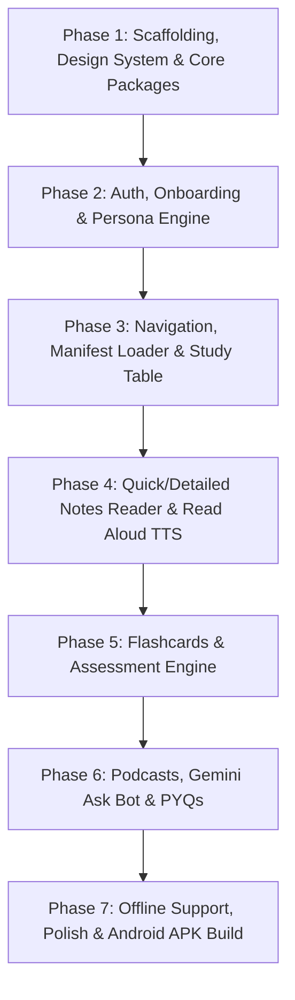

# Master Orchestration Plan: Saral Vidhya Web to React Native Expo Mobile App

## Objective
Sequentially execute all implementation phases to convert the web application (`saralvidhya-mvp`) into a fully functional, production-ready React Native Expo Android mobile app (`saralvidhya-mobile`).

---

## Execution Pipeline

This master plan orchestrates individual phase prompts located in the `prompts/` directory. Each phase must be executed, verified against its acceptance criteria, and checked off before proceeding to the next.

---

## Execution Phases & Checklists

### [x] Phase 1: Scaffolding, Design Tokens & Core Packages
- **Prompt File**: [`01_phase1_scaffolding_design_tokens.md`](./01_phase1_scaffolding_design_tokens.md)
- **Primary Goal**: Setup Expo SDK dependencies, brand tokens, colors, typography, theme context, and base layout.
- **Verification Gate**:
  - Run `npm run start` or `npx expo lint` in `saralvidhya-mobile` with zero compiler/syntax errors. (PASSED ✅)
  - Theme provider successfully exports Saral Vidhya emerald `#22c55e` and slate `#0f172a` palettes. (PASSED ✅)

---

### [x] Phase 2: Auth, Onboarding & Student Persona Engine
- **Prompt File**: [`02_phase2_auth_onboarding_persona.md`](./02_phase2_auth_onboarding_persona.md)
- **Primary Goal**: Replace browser `localStorage` with `AsyncStorage`, create student login, onboarding flow, persona picker (Beginner/Intermediate/Advanced), and diagnostic questionnaire.
- **Verification Gate**:
  - User state persists across app reloads via `AsyncStorage`. (PASSED ✅)
  - Questionnaire responses compute and save the student persona and learning style. (PASSED ✅)

---

### [x] Phase 3: Bottom Navigation, Manifest Loader & Study Table
- **Prompt File**: [`03_phase3_navigation_study_table.md`](./03_phase3_navigation_study_table.md)
- **Primary Goal**: Build Expo Router bottom tabs (Subjects, Study Table, Leaderboard, Profile), migrate ANGRAU Cloud Run manifest loader, and build the interactive Study Table screen.
- **Verification Gate**:
  - ANGRAU subjects and chapters load correctly from backend API. (PASSED ✅)
  - Study Table displays chapter tool cards and floating "Up Next" button. (PASSED ✅)

---

### [x] Phase 4: Quick/Detailed Notes Reader & Read Aloud TTS
- **Prompt File**: [`04_phase4_reading_notes_markdown.md`](./04_phase4_reading_notes_markdown.md)
- **Primary Goal**: Native Markdown viewer supporting formatted text, tables, and KaTeX mathematical formulas with a native `expo-speech` Read Aloud toolbar.
- **Verification Gate**:
  - Chapter markdown notes render cleanly with headings, lists, and tables. (PASSED ✅)
  - Read Aloud plays, pauses, stops, and adjusts speed smoothly on Android. (PASSED ✅)

---

### [x] Phase 5: Interactive Flashcards & Assessment Engine
- **Prompt File**: [`05_phase5_flashcards_assessments.md`](./05_phase5_flashcards_assessments.md)
- **Primary Goal**: 3D flip card animations with swipe gestures using Reanimated, followed by the complete MCQ/MSQ assessment quiz engine with score breakdown.
- **Verification Gate**:
  - Flashcards flip on tap and swipe left/right to mark mastery. (PASSED ✅)
  - Quizzes support single-choice and multiple-select with instant explanations and score reports. (PASSED ✅)

---

### [x] Phase 6: Background Podcasts, Gemini Ask Bot & PYQs
- **Prompt File**: [`06_phase6_podcasts_askbot_pyq.md`](./06_phase6_podcasts_askbot_pyq.md)
- **Primary Goal**: Background audio podcast player using `expo-av`, conversational AI assistant (Ask Bot) powered by Gemini API, and Previous Year Questions (PYQs) archive.
- **Verification Gate**:
  - Audio podcast plays in the background with lock screen controls. (PASSED ✅)
  - Gemini Ask Bot answers chapter-specific questions accurately with streaming responses. (PASSED ✅)
  - PYQs render 2-mark, 5-mark, and 10-mark model answers in collapsible accordions. (PASSED ✅)

---

### [x] Phase 7: Offline Caching, Android Optimization & Standalone APK
- **Prompt File**: [`07_phase7_polish_offline_android_build.md`](./07_phase7_polish_offline_android_build.md)
- **Primary Goal**: Offline caching of accessed chapters, splash screen, Android adaptive icons, permissions, and EAS Build configuration for generating test APKs.
- **Verification Gate**:
  - Cached chapters are accessible in Airplane mode. (PASSED ✅)
  - `eas.json` is properly configured for APK generation. (PASSED ✅)
  - Full TypeScript type-checking passes cleanly across the mobile codebase. (PASSED ✅)

---

## Instructions for AI Agents / Developers
To run this pipeline:
1. Open the prompt file corresponding to the current unchecked phase.
2. Read all requirements, specifications, and code files outlined in that prompt.
3. Execute the changes in `Production_grade/saralvidhya-mobile`.
4. Run the phase's **Verification Steps**.
5. Once all verification criteria pass, check off the phase in this master plan and proceed to the next prompt.
