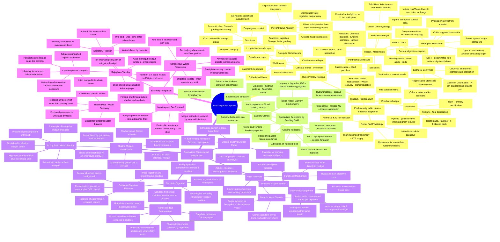

```mermaid
mindmap
  root((Insect Digestive System))

    %% ══════════════════════════════════════════════
    %% BRANCH 1 · THREE PRIMARY REGIONS   [L-1]
    %% ══════════════════════════════════════════════
    (Three Primary Regions)

      %% ── 1.1 FOREGUT  [L-2]
      (Foregut / Stomodaeum)
        [Ectodermal origin]
        [Has cuticular intima]
        [Functions: Ingestion  Storage  Initial grinding]

        %% ── Structures  [L-3]
        (Structures)
          [Pharynx - pumping]
          [Esophagus - conduit]
          [Crop - extensible storage organ]
          [Proventriculus / Gizzard - grinding and filtering]

        %% ── Proventriculus detail  [L-4]
        (Proventriculus Anatomy)
          [Six heavily sclerotised cuticular teeth]
          [Circular muscle sphincters]
          [Filters solid particles from liquid in chewing insects]
          [4 lip-valves filter pollen in honeybees]
          [Stomodaeal valve regulates midgut entry]

        %% ── Wall layers  [L-3]
        (Wall Layers)
          [Cuticular intima – innermost]
          [Epithelial cell layer]
          [Basement membrane]
          [Circular muscle layer]
          [Longitudinal muscle layer]

      %% ── 1.2 MIDGUT  [L-2]
      (Midgut / Mesenteron)
        [Endodermal origin]
        [No cuticular intima – direct absorption]
        [Functions: Chemical digestion · Enzyme secretion · Nutrient absorption]

        %% ── Structures  [L-3]
        (Structures)
          [Ventriculus – main stomach]
          [Gastric caeca – blind pouches]
          [Peritrophic Membrane]

        %% ── Gastric caeca detail  [L-4]
        (Gastric Caeca)
          [Expand absorptive surface area]
          [Secrete digestive enzymes]
          [Absorb glucose · amino acids · lipids]

        %% ── Peritrophic Membrane  [L-4]
        (Peritrophic Membrane)
          [Chitin + glycoprotein matrix]
          [Type I – delaminated from entire midgut epithelium]
          [Type II – secreted by anterior cardia ring organ]
          [Protects microvilli from abrasion]
          [Barrier against midgut pathogens]
          [Compartmentalises enzymes for recycling]

        %% ── Cell types  [L-3]
        (Epithelial Cell Types)
          [Columnar Enterocytes – secretion and absorption]
          [Regenerative Stem cells – tissue renewal]
          [Calciform Goblet cells – K-ion transport and alkaline pH]

        %% ── Goblet cell physiology  [L-4]
        (Goblet Cell Physiology)
          [V-type H-ATPase drives K-ion / H-ion exchange]
          [Creates luminal pH up to 11 in Lepidoptera]
          [Solubilises foliar tannins and allelochemicals]

      %% ── 1.3 HINDGUT  [L-2]
      (Hindgut / Proctodaeum)
        [Ectodermal origin]
        [Has cuticular intima]
        [Functions: Water reabsorption · Waste recovery · Osmoregulation]

        %% ── Structures  [L-3]
        (Structures)
          [Pylorus – junction valve with Malpighian tubules]
          [Ileum – primary modification]
          [Colon – water and ion recovery]
          [Rectum – final desiccation]
          [Rectal pads / Papillae – 6 thickened pads]

        %% ── Rectal pads detail  [L-4]
        (Rectal Pad Physiology)
          [High mitochondrial density – ATP supply]
          [Lateral intercellular canaliculi]
          [Active Na-K-Cl ion transport]
          [Hyper-osmotic zones draw water from feces]
          [Produces dry pellet urine – terrestrial adaptation]

    %% ══════════════════════════════════════════════
    %% BRANCH 2 · SALIVARY GLANDS   [L-1]
    %% ══════════════════════════════════════════════
    (Salivary Glands)

      %% ── Location and structure  [L-2]
      (Location and Structure)
        [Paired acinar / tubular glands in head-thorax]
        [Salivary duct opens into salivarium]
        [Salivarium lies behind hypopharynx]

      %% ── General functions  [L-2]
      (General Functions)
        [Lubrication of ingested food]
        [Partial pre-oral / extra-oral digestion]
        [Amylase · invertase · pectinase secretion]

      %% ── Specialised secretions  [L-3]
      (Specialised Secretions by Feeding Guild)
        [Silk – Lepidopteran larvae – cocoon formation]
        [Anti-coagulants – Blood-sucking insects]
        [Toxins and venoms – Predatory species]
        [Flocculating agent – Neuroptera larvae]

      %% ── Blood-feeder detail  [L-4]
      (Blood-feeder Salivary Biochemistry)
        [Apyrase – degrades ADP – blocks platelet aggregation]
        [Nitrophorins – release NO – induce vasodilation]
        [Hyaluronidases – spread factor – tissue penetration]
        [Examples: Rhodnius prolixus · Anopheles · Aedes]

    %% ══════════════════════════════════════════════
    %% BRANCH 3 · SPECIALIZED PHYSIOLOGICAL ADAPTATIONS   [L-1]
    %% ══════════════════════════════════════════════
    (Specialized Physiological Adaptations)

      %% ── 3.1 FILTER CHAMBER  [L-2]
      (Filter Chamber)
        [Found in phloem / xylem sap-sucking Hemiptera]
        [Aphids · Cicadas · Planthoppers · Whiteflies]

        %% ── Structure  [L-3]
        (Structural Arrangement)
          [Anterior midgut coiled around posterior midgut]
          [Malpighian tubules wrapped within same sheath]
          [Enclosed in connective-tissue tunic]

        %% ── Physiology  [L-3]
        (Functional Mechanism)
          [Shunts excess water directly to hindgut]
          [Bypasses main digestive zone]
          [Prevents enzyme dilution]
          [Excretes honeydew droplets]

        %% ── Osmotic detail  [L-4]
        (Osmotic Water Transfer)
          [Osmotic gradient drives trans-wall water movement]
          [Amino acids concentrated for midgut digestion]
          [Sugar excreted as honeydew – plant disease vector]

      %%  3.2 SYMBIOTIC DIGESTION  [L-2]
      (Symbiotic Digestion)
        [Hindgut paunch - fermentation chamber in termites]
        [Bacteria in gastric caeca of Heteroptera]
        [Mycetocytes harboring intracellular yeasts in beetles]

        %%  Termite symbiosis  [L-3]
        (Termite Hindgut Fermentation)
          [Flagellate protozoa - Trichonympha]
          [Phagocytosis of wood particles by flagellates]
          [Protozoan cellulase breaks cellulose to glucose]
          [Anaerobic fermentation to acetate and volatile fatty acids]
          [Mutualistic - termite cannot digest wood alone]

        %%  Biochemical steps  [L-4]
        (Cellulose Digestion Pathway)
          [Wood ingestion and proventriculus grinding]
          [Flagellate phagocytosis in enlarged paunch]
          [Cellulase hydrolysis: cellulose to cellobiose to glucose]
          [Fermentation: glucose to acetate plus CO2 plus H2]
          [Acetate absorbed across hindgut wall]

      %%  3.3 ALKALINE MIDGUT  [L-2]
      (Alkaline Midgut - Lepidoptera)
        [pH 9 to 11 in larval caterpillar midgut]
        [Maintained by goblet cell V-ATPase]
        [Solubilises leaf proteins bound to tannins]
        [Mechanism of Bt toxin activation]

        %%  Bt toxin mode of action  [L-4]
        (Bt Cry Toxin Mode of Action)
          [Protoxin crystals ingested with food]
          [Solubilised in alkaline midgut lumen]
          [Proteolytic cleavage by midgut proteases]
          [Active toxin binds cadherin receptor]
          [Binds aminopeptidase-N on enterocyte microvilli]
          [Oligomeric pore formation causes osmotic lysis]
          [Larval death by gut rupture and septicemia]

      %% ── 3.4 CIBARIAL PUMP  [L-2]
      (Cibarial and Pharyngeal Pump)
        [In fluid-feeding Hemiptera · Diptera · Lepidoptera]
        [Muscular pump in cibarium or pharynx]
        [Generates suction to draw liquid food]
        [Essential for piercing-sucking mouthparts]

    %% ══════════════════════════════════════════════
    %% BRANCH 4 · EXCRETORY INTEGRATION   [L-1]
    %% ══════════════════════════════════════════════
    (Excretory Integration)

      %% ── 4.1 MALPIGHIAN TUBULES  [L-2]
      (Malpighian Tubules)
        [Arise at midgut-hindgut junction – pyloric region]
        [Blind-ended tubules bathed in hemolymph]
        [Number: 2 in scale insects to 250 plus in locusts]
        [Not embryologically part of midgut or hindgut]

        %% ── Filtration mechanism  [L-3]
        (Secretory Filtration)
          [Active K-Na transport into lumen]
          [Water follows by osmosis]
          [Uric acid · urea · ions enter tubule lumen]
          [Primary urine flows to pylorus and ileum]

        %% ── Cryptonephridial system  [L-4]
        (Cryptonephridial Complex)
          [Tubules ensheathed against rectal wall]
          [Perinephric membrane seals the complex]
          [K-ion pumped into tubule lumen]
          [Water drawn from rectum across perinephric membrane]
          [Ultra-dry feces – xeric habitat adaptation]

      %% ── 4.2 RECTAL PADS  [L-2]
      (Rectal Pads - Water Recovery)
        [6 thickened pads in rectum]
        [Reabsorb 90 percent of water from primary urine]
        [Produce hyper-osmotic urine and dry feces]
        [Critical for terrestrial water balance]

      %% ── 4.3 NITROGENOUS WASTE  [L-2]
      (Nitrogenous Waste Processing)
        [Uricotelic insects – main waste is uric acid]
        [Uric acid is insoluble and non-toxic]
        [Precipitates as dry crystals – minimal water loss]
        [Ammonotelic aquatic insects excrete ammonia]
        [Fat body synthesises uric acid from purines]

      %% ── 4.4 MOLTING AND GUT RENEWAL  [L-2]
      (Moulting and Gut Renewal)
        [Foregut and hindgut cuticle shed at each ecdysis]
        [Peritrophic membrane renewed continuously – not shed]
        [Midgut epithelium renewed by stem cell divisions]
        [Apolysis precedes ecdysis – intima detaches first]
```
