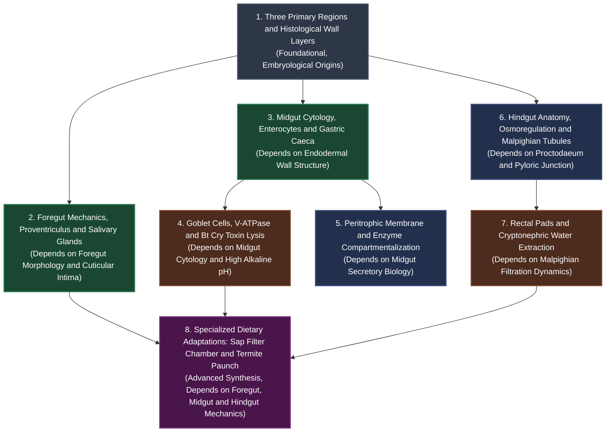

# Study Plan: Insect Digestive System

> **Academic Curriculum Alignment:** ANGRAU B.Sc. (Hons.) Agriculture — ENTO-131 Fundamentals of Entomology-I | Lecture 13: Insect Digestive System.  
> **Pedagogical Strategy:** Sequential prerequisite progression, topic-dependent pacing, active recall retrieval, and multi-tier assessment readiness gates.

---

## 🏛️ Subject-Wise Curriculum Context

In the Agricultural Entomology syllabus, the **Insect Digestive System** represents a heavily weighted core physiological unit. Unlike general external morphology, comprehension of this chapter directly underpins applied agricultural disciplines, including **toxicological insecticide targeting** (Bt endotoxins, stomach poisons), **vector-borne plant pathogen transmission** (aphid/planthopper honeydew and sap feeding), and **structural wood pest management** (subterranean termites).

```
Entomology-I Curriculum (Semester Allocation):
├── Module 1: Insect Body Wall & Integument (3 Days)
├── Module 2: Insect Mouthparts & Feeding Guilds (4 Days)
├── Module 3: Insect Digestive System [CURRENT] (5 Days Standard)
├── Module 4: Excretory & Circulatory Systems (4 Days)
└── Module 5: Respiratory & Nervous Systems (4 Days)
```

---

## 🧭 Topic Dependency Flowchart Blueprint

To achieve effortless comprehension and long-term retention, study topics strictly according to their prerequisite hierarchy. Never skip foundational histology before studying goblet cell ion transport or Bt toxin pore lysis:



---

## ⚡ Persona Cadence & Checkpoint Gates Matrix

| Persona | Checkpoint Cadence | Basics + Depth Gates | Revision Cadence | Daily Reading & Practice Flow |
| :--- | :--- | :--- | :--- | :--- |
| **Rookie / Beginner** | After every **1 topic** | **Separate days**, buffer between them | After every topic, **individually** | [Quick Study](/generated_resources/angrau/chapter_01/Learn/Quick_Summary/quick_summary_beginner.md) $\to$ [Detailed Study](/generated_resources/angrau/chapter_01/Learn/Detailed_Summary/detailed_summary_beginner.md) $\to$ [Key Takeaways](/generated_resources/angrau/chapter_01/key_takeaways.md) $\to$ [Beginner Flashcards](/generated_resources/angrau/chapter_01/Learn/Flashcards/flashcards_beginner.md) |
| **Intermediate** | After every **2 topics** | **Same session**, back-to-back | After every **day** | [Mindmap](/generated_resources/angrau/chapter_01/Learn/Mindmaps/digestive_system_mindmap.md) $\to$ [Quick Study](/generated_resources/angrau/chapter_01/Learn/Quick_Summary/quick_summary_intermediate.md) $\to$ [Detailed Study](/generated_resources/angrau/chapter_01/Learn/Detailed_Summary/detailed_summary_intermediate.md) $\to$ [Intermediate Flashcards](/generated_resources/angrau/chapter_01/Learn/Flashcards/flashcards_intermediate.md) $\to$ [Medium MCQ](/generated_resources/angrau/chapter_01/Learn/Assessments/MCQ/mcq_medium.md) |
| **Advanced / Honors** | After every **3+ topics** | **Same session**, batched synthesis | Batched across a **multi-topic day** | [Detailed Study](/generated_resources/angrau/chapter_01/Learn/Detailed_Summary/detailed_summary_advanced.md) $\to$ [Key Takeaways](/generated_resources/angrau/chapter_01/key_takeaways.md) $\to$ [Hard MCQ & MSQ](/generated_resources/angrau/chapter_01/Learn/Assessments/MCQ/mcq_hard.md) $\to$ [Question Bank](/generated_resources/angrau/chapter_01/question_bank.md) $\to$ [Certification Exam](/generated_resources/angrau/chapter_01/Examination/certification_exam.md) |

---

## 📖 Blueprint 1: Standard 5-Day Mastery Track (Rookie / University Semester)

Paced at ~48–58 minutes per day with exact temporal arithmetic summing to 260 minutes total (4.33 hours):

| Day | Modules Covered | Sequential Reading & Practice Path | Time |
| :---: | :--- | :--- | :---: |
| **Day 1** | **Three Primary Regions & Histological Wall Architecture** | [Mindmap](/generated_resources/angrau/chapter_01/Learn/Mindmaps/digestive_system_mindmap.md) (10m) $\to$ [Quick Study](/generated_resources/angrau/chapter_01/Learn/Quick_Summary/quick_summary_beginner.md) (12m) $\to$ [Detailed Study](/generated_resources/angrau/chapter_01/Learn/Detailed_Summary/detailed_summary_beginner.md) (18m) $\to$ [Key Takeaways](/generated_resources/angrau/chapter_01/key_takeaways.md) (5m) $\to$ [Beginner Flashcards](/generated_resources/angrau/chapter_01/Learn/Flashcards/flashcards_beginner.md) (5m) | **50m** |
| **Day 2** | **Foregut Mechanics, Proventricular Specializations & Salivary Glands** | [Quick Study](/generated_resources/angrau/chapter_01/Learn/Quick_Summary/quick_summary_beginner.md) (10m) $\to$ [Detailed Study](/generated_resources/angrau/chapter_01/Learn/Detailed_Summary/detailed_summary_beginner.md) (22m) $\to$ [Key Takeaways](/generated_resources/angrau/chapter_01/key_takeaways.md) (5m) $\to$ [Beginner Flashcards](/generated_resources/angrau/chapter_01/Learn/Flashcards/flashcards_beginner.md) (5m) $\to$ [Easy MCQ](/generated_resources/angrau/chapter_01/Learn/Assessments/MCQ/mcq_easy.md) (8m) | **50m** |
| **Day 3** | **Midgut Cytology, Goblet Cell V-ATPase, Bt Cry Lysis & Peritrophic Membrane** | [Quick Study](/generated_resources/angrau/chapter_01/Learn/Quick_Summary/quick_summary_beginner.md) (10m) $\to$ [Detailed Study](/generated_resources/angrau/chapter_01/Learn/Detailed_Summary/detailed_summary_beginner.md) (24m) $\to$ [Key Takeaways](/generated_resources/angrau/chapter_01/key_takeaways.md) (5m) $\to$ [Intermediate Flashcards](/generated_resources/angrau/chapter_01/Learn/Flashcards/flashcards_intermediate.md) (7m) $\to$ [Medium MCQ](/generated_resources/angrau/chapter_01/Learn/Assessments/MCQ/mcq_medium.md) (8m) | **54m** |
| **Day 4** | **Hindgut Osmoregulation, Malpighian Tubules, Cryptonephry & 6 Rectal Pads** | [Quick Study](/generated_resources/angrau/chapter_01/Learn/Quick_Summary/quick_summary_beginner.md) (10m) $\to$ [Detailed Study](/generated_resources/angrau/chapter_01/Learn/Detailed_Summary/detailed_summary_beginner.md) (22m) $\to$ [Key Takeaways](/generated_resources/angrau/chapter_01/key_takeaways.md) (5m) $\to$ [Intermediate Flashcards](/generated_resources/angrau/chapter_01/Learn/Flashcards/flashcards_intermediate.md) (7m) $\to$ [Easy MSQ](/generated_resources/angrau/chapter_01/Learn/Assessments/MSQ/msq_easy.md) (8m) | **52m** |
| **Day 5** | **Specialized Adaptations (Sap Filter Chamber, Termite Paunch) & Summative Review** | [Detailed Study](/generated_resources/angrau/chapter_01/Learn/Detailed_Summary/detailed_summary_beginner.md) (15m) $\to$ [Key Takeaways](/generated_resources/angrau/chapter_01/key_takeaways.md) (5m) $\to$ [Question Bank 2-Mark & 5-Mark](/generated_resources/angrau/chapter_01/question_bank.md) (15m) $\to$ [Mock Test Chapter 13](/generated_resources/angrau/chapter_01/Prepare/Mock_Test/mock_test_chapter_13.md) (19m) | **54m** |

---

## 🏃 Blueprint 2: Fast-Track 3-Day Sprint (Intermediate / Pre-Exam Review)

Calibrated at ~70–75 minutes per day for rapid mid-term review (220 minutes total / 3.67 hours):

| Day | Modules Covered | Reading & Practice Path | Time |
| :---: | :--- | :--- | :---: |
| **Day 1** | **Foregut Architecture, Proventriculus, Wall Histology & Salivary Glands** | [Mindmap](/generated_resources/angrau/chapter_01/Learn/Mindmaps/digestive_system_mindmap.md) (10m) $\to$ [Quick Study](/generated_resources/angrau/chapter_01/Learn/Quick_Summary/quick_summary_intermediate.md) (15m) $\to$ [Detailed Study](/generated_resources/angrau/chapter_01/Learn/Detailed_Summary/detailed_summary_intermediate.md) (30m) $\to$ [Intermediate Flashcards](/generated_resources/angrau/chapter_01/Learn/Flashcards/flashcards_intermediate.md) (10m) $\to$ [Medium MCQ](/generated_resources/angrau/chapter_01/Learn/Assessments/MCQ/mcq_medium.md) (8m) | **73m** |
| **Day 2** | **Midgut Cytology, Goblet Cell Physiology, Bt Mode of Action & Peritrophic Membrane** | [Detailed Study](/generated_resources/angrau/chapter_01/Learn/Detailed_Summary/detailed_summary_intermediate.md) (30m) $\to$ [Key Takeaways](/generated_resources/angrau/chapter_01/key_takeaways.md) (5m) $\to$ [Intermediate Flashcards](/generated_resources/angrau/chapter_01/Learn/Flashcards/flashcards_intermediate.md) (10m) $\to$ [Medium MSQ](/generated_resources/angrau/chapter_01/Learn/Assessments/MSQ/msq_medium.md) (12m) $\to$ [Question Bank v1 & v2](/generated_resources/angrau/chapter_01/question_bank.md) (15m) | **72m** |
| **Day 3** | **Hindgut Osmoregulation, Malpighian Tubules, Filter Chamber, Termites & Mock Exam** | [Detailed Study](/generated_resources/angrau/chapter_01/Learn/Detailed_Summary/detailed_summary_intermediate.md) (25m) $\to$ [Key Takeaways](/generated_resources/angrau/chapter_01/key_takeaways.md) (5m) $\to$ [Question Bank](/generated_resources/angrau/chapter_01/question_bank.md) (15m) $\to$ [Mock Test Chapter 13](/generated_resources/angrau/chapter_01/Prepare/Mock_Test/mock_test_chapter_13.md) (30m) | **75m** |

---

## 🚀 Blueprint 3: Intensive 2-Day Fast-Track Crash Course (Advanced / Honors & ICAR JRF)

Calibrated at ~100–105 minutes per day for competitive exam preparation (205 minutes total / 3.42 hours):

| Day | Modules Covered | Reading & Practice Path | Time |
| :---: | :--- | :--- | :---: |
| **Day 1** | **Full Anatomy, Proventriculus, Midgut Cytology, Goblet Cell V-ATPase & Bt Toxic Action** | [Mindmap](/generated_resources/angrau/chapter_01/Learn/Mindmaps/digestive_system_mindmap.md) (10m) $\to$ [Detailed Study Advanced](/generated_resources/angrau/chapter_01/Learn/Detailed_Summary/detailed_summary_advanced.md) (45m) $\to$ [Flashcards Advanced](/generated_resources/angrau/chapter_01/Learn/Flashcards/flashcards_advanced.md) (15m) $\to$ [Hard MCQ](/generated_resources/angrau/chapter_01/Learn/Assessments/MCQ/mcq_hard.md) (15m) $\to$ [Hard MSQ](/generated_resources/angrau/chapter_01/Learn/Assessments/MSQ/msq_hard.md) (15m) | **100m** |
| **Day 2** | **Hindgut Cryptonephry, 6 Rectal Pads, Filter Chamber, Termite Paunch & Certification Exam** | [Detailed Study Advanced](/generated_resources/angrau/chapter_01/Learn/Detailed_Summary/detailed_summary_advanced.md) (35m) $\to$ [Key Takeaways](/generated_resources/angrau/chapter_01/key_takeaways.md) (10m) $\to$ [Question Bank Full](/generated_resources/angrau/chapter_01/question_bank.md) (20m) $\to$ [Pre-Final Exam](/generated_resources/angrau/chapter_01/Examination/pre_final_exam.md) (40m) | **105m** |

---

## 📅 Blueprint 4: Distributed 14-Day Semester Track (~20–25 Mins/Day)

| Day | Focus Topic | Activity Sequence | Daily Time |
| :---: | :--- | :--- | :---: |
| **Day 1** | Gross Tripartite Anatomy | Mindmap exploration + Quick Study | **20m** |
| **Day 2** | Histological Wall Layers | Detailed Study wall section + Diagram labeling | **22m** |
| **Day 3** | Foregut Mechanics (Cibarium, Crop) | Detailed Study foregut + Flashcards | **20m** |
| **Day 4** | Proventriculus (Gizzard & Bee Filter) | Detailed Study proventriculus + Easy MCQ | **22m** |
| **Day 5** | Salivary Glands & Blood-Feeding Factors | Detailed Study salivary glands + Flashcards | **20m** |
| **Day 6** | Midgut Gross Anatomy & Gastric Caeca | Detailed Study caeca + Diagram review | **20m** |
| **Day 7** | Midgut Cytology (Enterocytes & Nidi) | Detailed Study enterocytes + Medium MCQ | **22m** |
| **Day 8** | Goblet Cells, V-ATPase & Luminal pH 11 | Detailed Study goblet cell physiology | **25m** |
| **Day 9** | Mode of Action of Bt Cry Protoxins | Detailed Study Bt toxic pathway + Medium MSQ | **25m** |
| **Day 10** | Peritrophic Membrane (Types I & II) | Detailed Study peritrophic membrane + Flashcards | **22m** |
| **Day 11** | Hindgut Anatomy & Malpighian Tubules | Detailed Study hindgut + Primary urine flow | **22m** |
| **Day 12** | Cryptonephry & 6 Rectal Pads | Detailed Study rectal pads + Hard MCQ | **24m** |
| **Day 13** | Specialized Adaptations (Filter Chamber & Termites) | Detailed Study filter chamber + paunch fermentation | **25m** |
| **Day 14** | Comprehensive Synthesis & Final Assessment | Key Takeaways + Question Bank + Mock Exam | **35m** |
