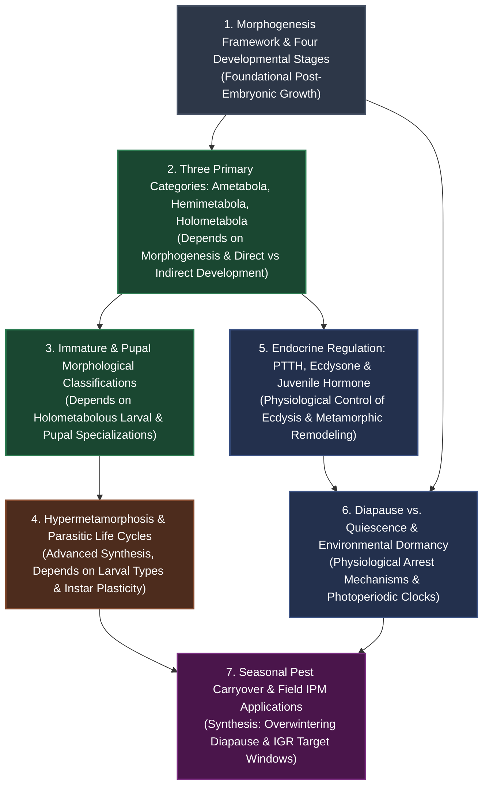

# Study Plan: Insect Metamorphosis and Diapause

> **Academic Curriculum Alignment:** ANGRAU B.Sc. (Hons.) Agriculture — ENTO-131 Fundamentals of Entomology-I | Lecture 11: Metamorphosis and Diapause.  
> **Pedagogical Strategy:** Sequential prerequisite progression, topic-dependent pacing, active recall retrieval, and multi-tier assessment readiness gates.

---

## 🏛️ Subject-Wise Curriculum Context

In the Agricultural Entomology syllabus, **Metamorphosis and Diapause** represents a cornerstone physiological and developmental unit. Mastery of this chapter directly governs applied pest management disciplines, including:
1. **Pesticide Application Windows**: Targeting vulnerable immature instars (e.g., early-instar caterpillars) before heavily sclerotized pupation or diapausing stages.
2. **Insect Growth Regulators (IGRs)**: Designing juvenile hormone mimics (methoprene, pyriproxyfen) and chitin synthesis inhibitors (diflubenzuron) that disrupt ecdysone-regulated moulting.
3. **Forecasting & Seasonal Carryover**: Predicting pest outbreaks by tracking critical day lengths, diapause termination, and winter carryover in crop residues (e.g., *Scirpophaga incertulas* larvae in paddy stubbles; *Pectinophora gossypiella* in cotton seed).

```
Entomology-I Curriculum (Semester Progression):
├── Module 1: Insect Body Wall & Integument (3 Days)
├── Module 2: Insect Mouthparts & Feeding Guilds (4 Days)
├── Module 3: Metamorphosis & Diapause [CURRENT] (5 Days Standard)
├── Module 4: Insect Digestive & Excretory Systems (5 Days)
└── Module 5: Insect Reproductive & Endocrine Systems (4 Days)
```

---

## 🧭 Topic Dependency Flowchart Blueprint

Study topics strictly according to their prerequisite hierarchy. Never attempt endocrine hormonal feedback models before understanding the four developmental stages and metamorphosis categories:



---

## ⚡ Persona Cadence & Checkpoint Gates Matrix

| Persona | Checkpoint Cadence | Basics + Depth Gates | Revision Cadence | Daily Reading & Practice Flow |
| :--- | :--- | :--- | :--- | :--- |
| **Rookie / Beginner** | After every **1 topic** | **Separate days**, buffer between them | After every topic, **individually** | [Quick Study](file:///c:/Users/hulkh/Downloads/Gen%20Assest%20-%20Copy/Assets/ANGRAU/Entomology/chapter_11_metamorphosis/Learn/Quick_Summary/quick_summary_beginner.md) $\to$ [Detailed Study](file:///c:/Users/hulkh/Downloads/Gen%20Assest%20-%20Copy/Assets/ANGRAU/Entomology/chapter_11_metamorphosis/Learn/Detailed_Summary/detailed_summary_beginner.md) $\to$ [Key Takeaways](file:///c:/Users/hulkh/Downloads/Gen%20Assest%20-%20Copy/Assets/ANGRAU/Entomology/chapter_11_metamorphosis/new/key_takeaways.md) $\to$ [Beginner Flashcards](file:///c:/Users/hulkh/Downloads/Gen%20Assest%20-%20Copy/Assets/ANGRAU/Entomology/chapter_11_metamorphosis/Learn/Flashcards/flashcards_beginner.md) |
| **Intermediate** | After every **2 topics** | **Same session**, back-to-back | After every **day** | [Mindmap](file:///c:/Users/hulkh/Downloads/Gen%20Assest%20-%20Copy/Assets/ANGRAU/Entomology/chapter_11_metamorphosis/Learn/Mindmaps/metamorphosis_mindmap.md) $\to$ [Quick Study](file:///c:/Users/hulkh/Downloads/Gen%20Assest%20-%20Copy/Assets/ANGRAU/Entomology/chapter_11_metamorphosis/Learn/Quick_Summary/quick_summary_intermediate.md) $\to$ [Detailed Study](file:///c:/Users/hulkh/Downloads/Gen%20Assest%20-%20Copy/Assets/ANGRAU/Entomology/chapter_11_metamorphosis/Learn/Detailed_Summary/detailed_summary_intermediate.md) $\to$ [Intermediate Flashcards](file:///c:/Users/hulkh/Downloads/Gen%20Assest%20-%20Copy/Assets/ANGRAU/Entomology/chapter_11_metamorphosis/Learn/Flashcards/flashcards_intermediate.md) $\to$ [Medium MCQ](file:///c:/Users/hulkh/Downloads/Gen%20Assest%20-%20Copy/Assets/ANGRAU/Entomology/chapter_11_metamorphosis/Learn/Assessments/MCQ/mcq_medium.md) |
| **Advanced / Honors** | After every **3+ topics** | **Same session**, batched synthesis | Batched across a **multi-topic day** | [Detailed Study](file:///c:/Users/hulkh/Downloads/Gen%20Assest%20-%20Copy/Assets/ANGRAU/Entomology/chapter_11_metamorphosis/Learn/Detailed_Summary/detailed_summary_advanced.md) $\to$ [Key Takeaways](file:///c:/Users/hulkh/Downloads/Gen%20Assest%20-%20Copy/Assets/ANGRAU/Entomology/chapter_11_metamorphosis/new/key_takeaways.md) $\to$ [Hard MCQ & MSQ](file:///c:/Users/hulkh/Downloads/Gen%20Assest%20-%20Copy/Assets/ANGRAU/Entomology/chapter_11_metamorphosis/Learn/Assessments/MCQ/mcq_hard.md) $\to$ [Question Bank](file:///c:/Users/hulkh/Downloads/Gen%20Assest%20-%20Copy/Assets/ANGRAU/Entomology/chapter_11_metamorphosis/new/question_bank.md) $\to$ [Certification Exam](file:///c:/Users/hulkh/Downloads/Gen%20Assest%20-%20Copy/Assets/ANGRAU/Entomology/chapter_11_metamorphosis/Examination/certification_exam.md) |

---

## 📖 Blueprint 1: Standard 5-Day Mastery Track (Rookie / University Semester)

Paced at ~48–55 minutes per day with exact temporal arithmetic summing to 255 minutes total (4.25 hours):

| Day | Modules Covered | Sequential Reading & Practice Path | Time |
| :---: | :--- | :--- | :---: |
| **Day 1** | **Morphogenesis Framework & Three Metamorphosis Categories** | [Mindmap](file:///c:/Users/hulkh/Downloads/Gen%20Assest%20-%20Copy/Assets/ANGRAU/Entomology/chapter_11_metamorphosis/Learn/Mindmaps/metamorphosis_mindmap.md) (10m) $\to$ [Quick Study](file:///c:/Users/hulkh/Downloads/Gen%20Assest%20-%20Copy/Assets/ANGRAU/Entomology/chapter_11_metamorphosis/Learn/Quick_Summary/quick_summary_beginner.md) (12m) $\to$ [Detailed Study](file:///c:/Users/hulkh/Downloads/Gen%20Assest%20-%20Copy/Assets/ANGRAU/Entomology/chapter_11_metamorphosis/Learn/Detailed_Summary/detailed_summary_beginner.md) (18m) $\to$ [Key Takeaways](file:///c:/Users/hulkh/Downloads/Gen%20Assest%20-%20Copy/Assets/ANGRAU/Entomology/chapter_11_metamorphosis/new/key_takeaways.md) (5m) $\to$ [Beginner Flashcards](file:///c:/Users/hulkh/Downloads/Gen%20Assest%20-%20Copy/Assets/ANGRAU/Entomology/chapter_11_metamorphosis/Learn/Flashcards/flashcards_beginner.md) (5m) | **50m** |
| **Day 2** | **Immature Larval Classifications & Pupal Morphotypes** | [Quick Study](file:///c:/Users/hulkh/Downloads/Gen%20Assest%20-%20Copy/Assets/ANGRAU/Entomology/chapter_11_metamorphosis/Learn/Quick_Summary/quick_summary_beginner.md) (10m) $\to$ [Detailed Study](file:///c:/Users/hulkh/Downloads/Gen%20Assest%20-%20Copy/Assets/ANGRAU/Entomology/chapter_11_metamorphosis/Learn/Detailed_Summary/detailed_summary_beginner.md) (22m) $\to$ [Key Takeaways](file:///c:/Users/hulkh/Downloads/Gen%20Assest%20-%20Copy/Assets/ANGRAU/Entomology/chapter_11_metamorphosis/new/key_takeaways.md) (5m) $\to$ [Beginner Flashcards](file:///c:/Users/hulkh/Downloads/Gen%20Assest%20-%20Copy/Assets/ANGRAU/Entomology/chapter_11_metamorphosis/Learn/Flashcards/flashcards_beginner.md) (5m) $\to$ [Easy MCQ](file:///c:/Users/hulkh/Downloads/Gen%20Assest%20-%20Copy/Assets/ANGRAU/Entomology/chapter_11_metamorphosis/Learn/Assessments/MCQ/mcq_easy.md) (8m) | **50m** |
| **Day 3** | **Hypermetamorphosis & Specialized Instars (Meloidae / Stylopidae)** | [Quick Study](file:///c:/Users/hulkh/Downloads/Gen%20Assest%20-%20Copy/Assets/ANGRAU/Entomology/chapter_11_metamorphosis/Learn/Quick_Summary/quick_summary_beginner.md) (10m) $\to$ [Detailed Study](file:///c:/Users/hulkh/Downloads/Gen%20Assest%20-%20Copy/Assets/ANGRAU/Entomology/chapter_11_metamorphosis/Learn/Detailed_Summary/detailed_summary_beginner.md) (22m) $\to$ [Key Takeaways](file:///c:/Users/hulkh/Downloads/Gen%20Assest%20-%20Copy/Assets/ANGRAU/Entomology/chapter_11_metamorphosis/new/key_takeaways.md) (5m) $\to$ [Intermediate Flashcards](file:///c:/Users/hulkh/Downloads/Gen%20Assest%20-%20Copy/Assets/ANGRAU/Entomology/chapter_11_metamorphosis/Learn/Flashcards/flashcards_intermediate.md) (7m) $\to$ [Medium MCQ](file:///c:/Users/hulkh/Downloads/Gen%20Assest%20-%20Copy/Assets/ANGRAU/Entomology/chapter_11_metamorphosis/Learn/Assessments/MCQ/mcq_medium.md) (8m) | **52m** |
| **Day 4** | **Endocrine Regulation: PTTH, Ecdysone & Juvenile Hormone Titers** | [Quick Study](file:///c:/Users/hulkh/Downloads/Gen%20Assest%20-%20Copy/Assets/ANGRAU/Entomology/chapter_11_metamorphosis/Learn/Quick_Summary/quick_summary_beginner.md) (10m) $\to$ [Detailed Study](file:///c:/Users/hulkh/Downloads/Gen%20Assest%20-%20Copy/Assets/ANGRAU/Entomology/chapter_11_metamorphosis/Learn/Detailed_Summary/detailed_summary_beginner.md) (20m) $\to$ [Key Takeaways](file:///c:/Users/hulkh/Downloads/Gen%20Assest%20-%20Copy/Assets/ANGRAU/Entomology/chapter_11_metamorphosis/new/key_takeaways.md) (5m) $\to$ [Intermediate Flashcards](file:///c:/Users/hulkh/Downloads/Gen%20Assest%20-%20Copy/Assets/ANGRAU/Entomology/chapter_11_metamorphosis/Learn/Flashcards/flashcards_intermediate.md) (7m) $\to$ [Easy MSQ](file:///c:/Users/hulkh/Downloads/Gen%20Assest%20-%20Copy/Assets/ANGRAU/Entomology/chapter_11_metamorphosis/Learn/Assessments/MSQ/msq_easy.md) (8m) | **50m** |
| **Day 5** | **Diapause vs Quiescence, Photoperiodism & Summative Chapter Assessment** | [Detailed Study](file:///c:/Users/hulkh/Downloads/Gen%20Assest%20-%20Copy/Assets/ANGRAU/Entomology/chapter_11_metamorphosis/Learn/Detailed_Summary/detailed_summary_beginner.md) (14m) $\to$ [Key Takeaways](file:///c:/Users/hulkh/Downloads/Gen%20Assest%20-%20Copy/Assets/ANGRAU/Entomology/chapter_11_metamorphosis/new/key_takeaways.md) (5m) $\to$ [Question Bank 2-Mark & 5-Mark](file:///c:/Users/hulkh/Downloads/Gen%20Assest%20-%20Copy/Assets/ANGRAU/Entomology/chapter_11_metamorphosis/new/question_bank.md) (15m) $\to$ [Mock Test Chapter 11](file:///c:/Users/hulkh/Downloads/Gen%20Assest%20-%20Copy/Assets/ANGRAU/Entomology/chapter_11_metamorphosis/Prepare/Mock_Test/mock_test_chapter_11.md) (19m) | **53m** |

---

## 🏃 Blueprint 2: Fast-Track 3-Day Sprint (Intermediate / Pre-Exam Review)

Calibrated at ~70–75 minutes per day for rapid mid-term review (220 minutes total / 3.67 hours):

| Day | Modules Covered | Reading & Practice Path | Time |
| :---: | :--- | :--- | :---: |
| **Day 1** | **Morphogenesis, Metamorphosis Categories, Larval & Pupal Classifications** | [Mindmap](file:///c:/Users/hulkh/Downloads/Gen%20Assest%20-%20Copy/Assets/ANGRAU/Entomology/chapter_11_metamorphosis/Learn/Mindmaps/metamorphosis_mindmap.md) (10m) $\to$ [Quick Study](file:///c:/Users/hulkh/Downloads/Gen%20Assest%20-%20Copy/Assets/ANGRAU/Entomology/chapter_11_metamorphosis/Learn/Quick_Summary/quick_summary_intermediate.md) (15m) $\to$ [Detailed Study](file:///c:/Users/hulkh/Downloads/Gen%20Assest%20-%20Copy/Assets/ANGRAU/Entomology/chapter_11_metamorphosis/Learn/Detailed_Summary/detailed_summary_intermediate.md) (30m) $\to$ [Intermediate Flashcards](file:///c:/Users/hulkh/Downloads/Gen%20Assest%20-%20Copy/Assets/ANGRAU/Entomology/chapter_11_metamorphosis/Learn/Flashcards/flashcards_intermediate.md) (10m) $\to$ [Medium MCQ](file:///c:/Users/hulkh/Downloads/Gen%20Assest%20-%20Copy/Assets/ANGRAU/Entomology/chapter_11_metamorphosis/Learn/Assessments/MCQ/mcq_medium.md) (8m) | **73m** |
| **Day 2** | **Hypermetamorphosis & Endocrine Regulation (PTTH, Ecdysone, Juvenile Hormone)** | [Detailed Study](file:///c:/Users/hulkh/Downloads/Gen%20Assest%20-%20Copy/Assets/ANGRAU/Entomology/chapter_11_metamorphosis/Learn/Detailed_Summary/detailed_summary_intermediate.md) (30m) $\to$ [Key Takeaways](file:///c:/Users/hulkh/Downloads/Gen%20Assest%20-%20Copy/Assets/ANGRAU/Entomology/chapter_11_metamorphosis/new/key_takeaways.md) (5m) $\to$ [Intermediate Flashcards](file:///c:/Users/hulkh/Downloads/Gen%20Assest%20-%20Copy/Assets/ANGRAU/Entomology/chapter_11_metamorphosis/Learn/Flashcards/flashcards_intermediate.md) (10m) $\to$ [Medium MSQ](file:///c:/Users/hulkh/Downloads/Gen%20Assest%20-%20Copy/Assets/ANGRAU/Entomology/chapter_11_metamorphosis/Learn/Assessments/MSQ/msq_medium.md) (12m) $\to$ [Question Bank v1 & v2](file:///c:/Users/hulkh/Downloads/Gen%20Assest%20-%20Copy/Assets/ANGRAU/Entomology/chapter_11_metamorphosis/new/question_bank.md) (15m) | **72m** |
| **Day 3** | **Diapause vs Quiescence, Photoperiodism, Pest Overwintering & Mock Exam** | [Detailed Study](file:///c:/Users/hulkh/Downloads/Gen%20Assest%20-%20Copy/Assets/ANGRAU/Entomology/chapter_11_metamorphosis/Learn/Detailed_Summary/detailed_summary_intermediate.md) (25m) $\to$ [Key Takeaways](file:///c:/Users/hulkh/Downloads/Gen%20Assest%20-%20Copy/Assets/ANGRAU/Entomology/chapter_11_metamorphosis/new/key_takeaways.md) (5m) $\to$ [Question Bank](file:///c:/Users/hulkh/Downloads/Gen%20Assest%20-%20Copy/Assets/ANGRAU/Entomology/chapter_11_metamorphosis/new/question_bank.md) (15m) $\to$ [Mock Test Chapter 11](file:///c:/Users/hulkh/Downloads/Gen%20Assest%20-%20Copy/Assets/ANGRAU/Entomology/chapter_11_metamorphosis/Prepare/Mock_Test/mock_test_chapter_11.md) (30m) | **75m** |

---

## 🚀 Blueprint 3: Intensive 2-Day Fast-Track Crash Course (Advanced / Honors & ICAR JRF)

Calibrated at ~100–105 minutes per day for competitive exam preparation (205 minutes total / 3.42 hours):

| Day | Modules Covered | Reading & Practice Path | Time |
| :---: | :--- | :--- | :---: |
| **Day 1** | **Morphogenesis, Metamorphosis Typologies, Larval Classifications & Endocrine Control** | [Mindmap](file:///c:/Users/hulkh/Downloads/Gen%20Assest%20-%20Copy/Assets/ANGRAU/Entomology/chapter_11_metamorphosis/Learn/Mindmaps/metamorphosis_mindmap.md) (10m) $\to$ [Detailed Study Advanced](file:///c:/Users/hulkh/Downloads/Gen%20Assest%20-%20Copy/Assets/ANGRAU/Entomology/chapter_11_metamorphosis/Learn/Detailed_Summary/detailed_summary_advanced.md) (45m) $\to$ [Flashcards Advanced](file:///c:/Users/hulkh/Downloads/Gen%20Assest%20-%20Copy/Assets/ANGRAU/Entomology/chapter_11_metamorphosis/Learn/Flashcards/flashcards_advanced.md) (15m) $\to$ [Hard MCQ](file:///c:/Users/hulkh/Downloads/Gen%20Assest%20-%20Copy/Assets/ANGRAU/Entomology/chapter_11_metamorphosis/Learn/Assessments/MCQ/mcq_hard.md) (15m) $\to$ [Hard MSQ](file:///c:/Users/hulkh/Downloads/Gen%20Assest%20-%20Copy/Assets/ANGRAU/Entomology/chapter_11_metamorphosis/Learn/Assessments/MSQ/msq_hard.md) (15m) | **100m** |
| **Day 2** | **Hypermetamorphosis, Diapause vs Quiescence, Photoperiodic CDL & Certification Exam** | [Detailed Study Advanced](file:///c:/Users/hulkh/Downloads/Gen%20Assest%20-%20Copy/Assets/ANGRAU/Entomology/chapter_11_metamorphosis/Learn/Detailed_Summary/detailed_summary_advanced.md) (35m) $\to$ [Key Takeaways](file:///c:/Users/hulkh/Downloads/Gen%20Assest%20-%20Copy/Assets/ANGRAU/Entomology/chapter_11_metamorphosis/new/key_takeaways.md) (10m) $\to$ [Question Bank Full](file:///c:/Users/hulkh/Downloads/Gen%20Assest%20-%20Copy/Assets/ANGRAU/Entomology/chapter_11_metamorphosis/new/question_bank.md) (20m) $\to$ [Pre-Final Exam](file:///c:/Users/hulkh/Downloads/Gen%20Assest%20-%20Copy/Assets/ANGRAU/Entomology/chapter_11_metamorphosis/Examination/pre_final_exam.md) (40m) | **105m** |

---

## 📅 Blueprint 4: Distributed 14-Day Semester Track (~20–25 Mins/Day)

| Day | Focus Topic | Activity Sequence | Daily Time |
| :---: | :--- | :--- | :---: |
| **Day 1** | Morphogenesis & Developmental Stages | Mindmap exploration + Quick Study | **20m** |
| **Day 2** | Ametabolous Development (Apterygota) | Detailed Study ametabola + Diagram review | **20m** |
| **Day 3** | Hemimetabolous Development (Exopterygota) | Detailed Study hemimetabola + Flashcards | **22m** |
| **Day 4** | Holometabolous Development (Endopterygota) | Detailed Study holometabola + Easy MCQ | **22m** |
| **Day 5** | Eruciform & Scarabaeiform Larvae | Detailed Study larval anatomy + Flashcards | **20m** |
| **Day 6** | Campodeiform, Elateriform & Vermiform Larvae | Detailed Study apodous types + Medium MCQ | **22m** |
| **Day 7** | Pupal Classifications (Exarate, Obtect, Coarctate) | Detailed Study pupal types + Flashcards | **22m** |
| **Day 8** | Decticous vs Adecticous Mandibles | Detailed Study mandibles + Diagram review | **20m** |
| **Day 9** | Hypermetamorphosis & Triungulin Cycle in Meloidae | Detailed Study hypermetamorphosis + Medium MSQ | **25m** |
| **Day 10** | Endocrine Regulation: PTTH & Prothoracic Ecdysone | Detailed Study brain hormones + Flashcards | **22m** |
| **Day 11** | Corpora Allata & Juvenile Hormone Titer Shifts | Detailed Study JH titration + Hard MCQ | **24m** |
| **Day 12** | Diapause vs Quiescence & Photoperiodic CDL | Detailed Study diapause induction + Hard MSQ | **25m** |
| **Day 13** | Obligatory vs Facultative & Stage-Specific Dormancy | Detailed Study pest carryover in stubble/seeds | **25m** |
| **Day 14** | Comprehensive Synthesis & Final Assessment | Key Takeaways + Question Bank + Mock Exam | **35m** |
