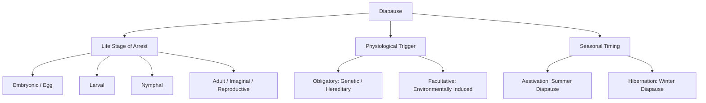
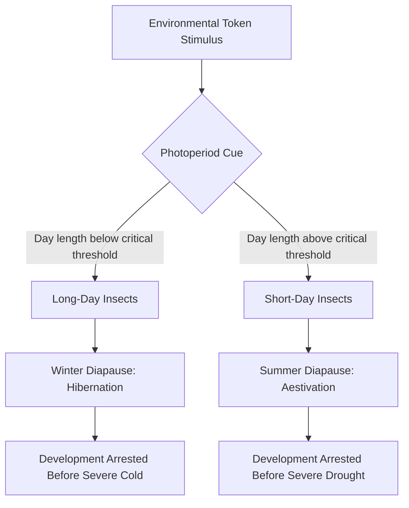

# Introduction

In insect development, hatching from the egg is only the first step in a long series of developmental events. From hatching onward, the insect undergoes a highly regulated sequence of structural, physiological, and behavioral changes that transform it from a sexually immature, wingless juvenile to a fully developed, reproductively capable adult. Collectively, all of these post-embryonic changes—which encompass somatic growth and cuticle shedding (moulting) in the larval stages, tissue differentiation in the pupal stages, and reproductive maturation in the adult stage—are known as **morphogenesis**.

**Metamorphosis** is the specific biological process of structural transformation that links these developmental phases. It allows a single organism to navigate through radically different body plans, ecological niches, and food sources over its lifespan. The evolutionary success of insects is heavily tied to this process, as demonstrated by the complete metamorphosis cycles of key representative species:
*   **Ladybug Metamorphosis:** Illustrates a circular, four-stage progression: eggs laid on a leaf hatch into a mobile, predatory larva, which eventually anchors to a surface to form a stationary pupa, finally emerging as a fully formed adult ladybug


.
*   **Monarch Butterfly Metamorphosis:** Demonstrates a classic holometabolous cycle where the egg laid on a milkweed leaf hatches into a voracious caterpillar (larva), which constructs a hanging chrysalis (pupa) to undergo complete tissue remodeling, emerging as a winged adult monarch butterfly


.

---

#

# 1. Morphogenesis: The Framework of Post-Embryonic Development

Morphogenesis is best understood as a highly coordinated developmental arc divided into three sequential biological phases:
1.  **Growth and Moulting:** Occurs during the immature (larval or nymphal) stages. The insect feeds voraciously and periodically sheds its rigid exoskeleton (cuticle) through the process of ecdysis to accommodate its increasing body volume.
2.  **Differentiation:** Occurs primarily during the pupal stage of holometabolous insects. During this phase, juvenile tissues are broken down (histolysis) and reconstructed into adult structures (histogenesis).
3.  **Maturation and Reproduction:** Occurs in the final adult stage, where the insect completes the development of its reproductive organs and focuses its energy on dispersal and mating.

A classic example of this complete metamorphosis is seen in the Hawk Moth (*Manduca* spp.). The caterpillar serves as a highly efficient eating and growth machine; the pupa is a silent, stationary sculptor's studio where the entire body is rebuilt; and the adult emerges as a winged, highly mobile, nectar-sipping reproductive specialist.

To understand the diversity of these developmental pathways, entomologists classify insect life cycles based on the presence or absence of a pupal transition stage, which separates indirect development from direct development


:

```
[Egg] ---> Direct Development ---> [Nymph] ---> [Adult] (Hemimetabolous)
[Egg] ---> Indirect Development ---> [Larva] ---> [Pupa] ---> [Adult] (Holometabolous)
```

---

#

# 2. The Three Categories of Metamorphosis

Entomologists classify insect development into three primary categories based on the degree of structural change, terminology of the young, wing development, and taxonomic placement. These categories are detailed across the following comparative parameters:

#

## Table 1: Structural and Developmental Stages
*   **No Metamorphosis (A-metamorphosis):** Undergoes slight or no metamorphosis. The life cycle includes 3 developmental stages: egg, larva, and adult. Development is direct (young one directly becomes adult).
*   **Incomplete Metamorphosis (Hemi-metamorphosis):** Undergoes incomplete metamorphosis. The life cycle includes 3 developmental stages: egg, nymph, and adult. Development is direct (young one directly becomes adult).
*   **Complete Metamorphosis (Holo-Metamorphosis):** Undergoes complete metamorphosis. The life cycle includes 4 developmental stages: egg, larva, pupa, and adult. Development is indirect (young one develops into a pupa, then into an adult).

#

## Table 2: Morphological and Feeding Characteristics
*   **No Metamorphosis:** The young (immature) looks exactly like the adult in all characters, only missing fully developed sexual organs. The young one is referred to as a larva or nymph. Immature and mature stages share the same food habits.
*   **Incomplete Metamorphosis:** The young one (nymph) resembles the adult in all characters except for the absence of wings. The immature stage is called a nymph. Nymphs and adults share the same food habits.
*   **Complete Metamorphosis:** The young one (larva) does not resemble the adult at all; it is usually wormlike and differs significantly in both morphological characters and feeding habits. The immature stage is called a larva. Larval and adult food habits are totally different.

#

## Table 3: Evolutionary, Wing, and Abundance Parameters
*   **No Metamorphosis:** The larva/nymph directly becomes an adult with no pupal stage. Adults are wingless. This is characteristic of primitive, wingless **Apterygote** insects. This group represents less than 0.1% of all insect species.
*   **Incomplete Metamorphosis:** The nymph directly becomes an adult; the pupal stage is entirely absent. Wings develop gradually and externally during the growth of the nymph. This is characteristic of lower insect orders, classified as **Exopterygote** insects. This group represents about 12% of all insect species.
*   **Complete Metamorphosis:** The young undergoes a pupal stage before reaching adulthood; the pupal stage is present. Wings develop internally during the growth of the adult inside the pupa. This is characteristic of higher insect orders, classified as **Endopterygote** insects. This group represents about 88% of all insect species.

---

#

## 2.1 No Metamorphosis (Ametabolous Development)

In ametabolous development, insects undergo direct development. Because they belong to the primitive, ancestrally wingless **Apterygote** orders, there is no evolutionary pressure to develop wings. The eggs are laid with no protective coverings. When the young larva hatches, it is morphologically identical to the adult, differing only in body size and the lack of functional reproductive organs


. It undergoes a series of progressive molts, maintaining the exact same dietary preferences and occupying the same ecological niche as the adult throughout its life.

---

#

## 2.2 Incomplete Metamorphosis (Hemimetabolous Development)

In hemimetabolous development, the life cycle consists of the egg, nymph, and adult stages. The eggs are typically protected, often covered by an egg case (ootheca) that holds them together. The immature stage, called a **nymph**, is a terrestrial or aquatic juvenile that closely resembles the adult but lacks functional wings and mature genitalia.

Because they are **Exopterygote** insects, their wings develop externally as visible wing pads on the thorax, growing larger with each successive molt. For example, in a typical grasshopper life cycle, the egg hatches into a first-stage nymph, which progresses through five distinct nymphal instars via five molts, directly emerging as a winged adult after the final molt with no intervening pupal stage


. Nymphs and adults share the same mouthparts and food habits, meaning they often compete for the same resources.

---

#

## 2.3 Complete Metamorphosis (Holometabolous Development)

Holometabolous development is the most evolutionary advanced and successful pathway, utilized by approximately 88% of all insect species (the **Endopterygote** higher orders, such as Coleoptera, Lepidoptera, Diptera, and Hymenoptera). The life cycle comprises four distinct stages: egg, larva, pupa, and adult


. The eggs are sometimes protected by coverings of maternal hairs or scales.

Development is indirect. The immature stage is called a **larva**, which is typically wormlike and completely different from the adult in both morphology and behavior. Because larval and adult food habits are totally different, they do not compete with one another. For instance, a caterpillar (larva with chewing mouthparts feeding on foliage) transforms into a butterfly (adult with siphoning mouthparts feeding on nectar).

To bridge this morphological gap, a **pupa** stage is required. During this stationary phase, the insect undergoes intense internal restructuring. Wings, which have been developing internally from embryonic structures called imaginal discs, finally expand and harden.

*   **Holometabolous vs. Hemimetabolous Comparison:** In a butterfly (holometabolous), the larva must enter a pupal chrysalis before emerging as a winged adult. In a true bug or grasshopper (hemimetabolous), the nymph develops wing pads externally and molts directly into the adult without any pupal stage.

---

#

# 3. Hyper-Metamorphosis

**Hyper-metamorphosis** is a highly specialized variant of complete (holometabolous) metamorphosis in which at least one of the larval instars is morphologically and functionally distinct from the others. Instead of a uniform series of larval instars that simply increase in size


, the larval period is divided into distinct structural phases, often accompanied by a dramatic switch in feeding habits.

This process is classically illustrated by the life cycle of the blister beetle (family Meloidae)


:
1.  **Egg:** Laid in or near host habitats.
2.  **Triungulin Larva:** The highly active, mobile, long-legged first-stage larva. It is structurally adapted to search for and hitchhike on hosts (such as solitary bees or grasshopper egg pods).
3.  **Grub-like Larva:** After finding a food source, the triungulin molts into a series of sedentary, soft-bodied, grub-like larval instars specialized for feeding.
4.  **Coarctate Stage:** A subsequent, highly specialized resting larval instar characterized by a hardened, dark cuticle. It is a non-feeding, dormant stage designed to survive adverse environmental conditions (often acting as a pseudopupa).
5.  **Final Active Larva:** A brief, active larval stage that molts from the coarctate shell before pupation.
6.  **Pupa:** The stage where final adult differentiation occurs.
7.  **Adult Blister Beetle:** Emerges as a beetle with a body covered in fine hairs and wing covers (elytra) banded in bright orange and black, commonly found feeding on flower blossoms


.

---

#

# 4. Diapause: Definition and Occurrence

**Diapause** is defined as a state of arrested development in which the developmental arrest is actively enforced by an internal physiological mechanism rather than by concurrently unfavorable environmental conditions. This distinction is critical for survival:
*   **Diapause vs. Quiescence:** **Quiescence** is a direct, immediate, and non-programmed somatic response to unfavorable conditions (e.g., development stops when temperature drops below a threshold and resumes immediately when it warms up). Diapause, conversely, is an internally programmed pause triggered ahead of time by a biological clock


. Once entered, development cannot resume immediately, even if favorable conditions are temporarily restored.

Depending on the species, diapause can occur at any developmental stage: embryonic (egg), larval, nymphal, pupal, or adult (imaginal/reproductive) stage. Diapause is categorized using three main biological pathways:



---

#

## 4.1 Diapause across Developmental Stages: Illustrative Species

Diapause is highly species-specific and occurs at precise developmental windows to maximize survival. The following table details the specific stages and representative species:

#

## Table 4: Species-Specific Diapause Stages
*   **Early-Embryonic Stage (egg diapause):** Silkworm (*Bombyx mori*)
*   **Mid-embryonic stage (egg diapause):** Locust (*Schistocerca gregaria*)
*   **Post-Embryonic Stage (egg diapause):** Gypsy Moth (*Lymantria dispar*)
*   **Larval diapause:** Bamboo borer (*Omphisa fuscidentalis*), Rice stem borer (*Scirpophaga incertulas*), and Mosquitoes (*Aedes* spp.)
*   **Pupal diapause:** Cabbage White (*Pieris brassicae*)
*   **Adult diapause:** Colorado potato beetle (*Leptinotarsa decemlineata*)

---

#

# 5. Obligatory versus Facultative Diapause

Diapause is further classified by its physiological necessity and dependence on environmental cues:

#

## Obligatory Diapause
*   **Definition:** A state of suspended activity that is a hereditary character controlled by genes. It is species-specific and occurs in every generation regardless of the immediate environmental conditions.
*   **Occurrence:** Commonly seen in temperate-zone insects to synchronize their life cycle with seasonal changes. It is typically induced by changes in the photoperiod.
*   **Example:** Eggs of the silkworm (*Bombyx mori*), which must undergo embryonic diapause in every generation to complete their normal developmental program.

#

## Facultative Diapause
*   **Definition:** A flexible state of suspended activity that occurs only when induced by unfavorable environmental conditions. If conditions remain optimal, the insect bypasses diapause entirely and continues multi-generational development.
*   **Triggers:** Can be abiotic (such as temperature, rainfall, humidity, photoperiod, or food quality/type) or biotic (such as natural enemy pressure or high population density).
*   **Example:** Cotton pink bollworm (*Pectinophora gossypiella*), which enters larval diapause in response to adverse conditions but resumes development when favorable conditions return.

---

#

# 6. Photoperiod and the Timing of Diapause

Insects utilize environmental cues, known as **token stimuli**, to predict the onset of harsh seasons and enter diapause before lethal conditions actually arrive. The most reliable of these cues is the **photoperiod** (the relative lengths of day and night).

*   **Critical Day Length:** The specific day length at which exactly 50% of the insect population has entered diapause. The transition around this threshold is typically sudden and sharp.
*   **Long-day insects:** Insects that develop normally during long summer days but enter diapause when the day length falls below the critical day length threshold (signaling the approach of autumn/winter).
*   **Short-day insects:** Insects that develop normally when days are short (few hours of sunlight) but enter diapause when exposed to longer days (signaling the approach of summer).

This complex physiological response is mapped through environmental triggers to seasonal survival states:



---

#

## 6.1 Aestivation and Hibernation

Depending on the season in which the physiological arrest occurs, diapause is divided into two major survival strategies:
*   **Aestivation (Summer Diapause):** Arrested development during summer. Aestivating insects are active during the rainy season and enter dormancy (sleep) during periods of intense drought and summer heat.
*   **Hibernation (Winter Diapause):** Arrested development during winter. Hibernating insects enter dormancy to survive freezing temperatures and seasonal food scarcity.

To survive during active larval stages before entering these dormant states, insects have evolved specialized morphological defense mechanisms. A prime example is the Io moth caterpillar (*Automeris io*), which exhibits aposematic (warning) coloration—characterized by a vibrant green body with a white and reddish-lateral stripe—and is covered in highly branched, venomous urticating spines to deter predators


.
