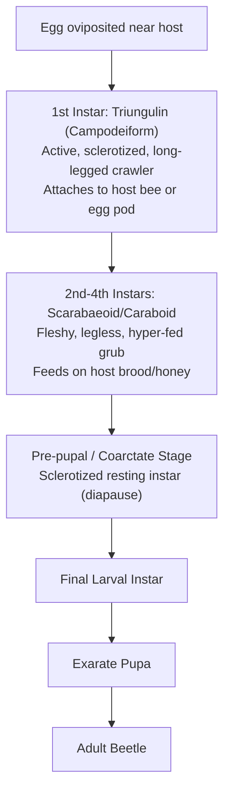

#

# 1. Cellular & Molecular Mechanics of Morphogenesis
Morphogenesis is the continuous post-embryonic developmental arc driven by epidermal cell commitment, differential gene expression, and tissue remodeling.

* **Three Morphogenetic Phases**:
  1. **Growth (Larval Instars)**: Driven by voracious nutrient ingestion, hypertrophy, and periodic apolysis/ecdysis under high Juvenile Hormone (JH) titers.
  2. **Differentiation (Pupal Phase)**: Triggered by an Ecdysone pulse in the presence of sub-threshold JH. Involves:
     * **Histolysis**: Programmed cell death (apoptosis) and autophagic digestion of obsolete larval tissues (gut, muscle) mediated by lysosomal enzymes.
     * **Histogenesis**: Rapid proliferation and differentiation of **imaginal discs** (undifferentiated epidermal cell pockets set aside in embryogenesis) into adult wings, legs, compound eyes, and antennae.
  3. **Maturation (Imago)**: Gonad maturation, vitellogenesis, and cuticular tanning.

---

#

# 2. Macro-Evolutionary Pathways & Decoupled Ecological Niches

| Parameter / Axis | Ametabolous (Apterygota) | Hemimetabolous (Exopterygota) | Holometabolous (Endopterygota) |
| :--- | :--- | :--- | :--- |
| **Phylogenetic Lineage** | Primitive basal hexapods | Lower Pterygote orders | Advanced Endopterygote orders |
| **Developmental Strategy** | Direct development (Graded growth) | Direct development (Nymphal instars) | Indirect development (Metamorphic pupa) |
| **Wing Morphogenesis** | Primary winglessness | External wing pads (Thoracic dorsum) | Internal imaginal discs (Everted in pupa) |
| **Ecological Niche Decoupling** | None (Nymph & adult co-exist) | Minimal (Nymph & adult compete) | **Complete decoupling** (Eliminates self-competition) |
| **Taxonomic Dominance** | $< 0.1\%$ species | $\sim 12\%$ species | **$\sim 88\%$ species** (Evolutionary breakthrough) |

#

## Evolutionary Significance of Holometabola:
Complete metamorphosis allows larvae to specialize exclusively on feeding and growth in protected or subterranean niches, while adults specialize exclusively on dispersal and sexual reproduction.

---

#

# 3. Immature & Pupal Morphological Adaptations

#

## A. Larval Morphological Spectrum
* **Eruciform**: Cylindrical, sclerotized head, 3 thoracic leg pairs, 2–5 abdominal proleg pairs with crochets (Lepidoptera, Symphyta).
* **Scarabaeiform**: Fleshy C-shaped grub, sclerotized head, well-developed thoracic legs, no prolegs (Scarabaeidae).
* **Campodeiform**: Elongate, dorso-ventrally flattened active predator, long cursorial legs, caudal filaments (Neuroptera, Carabidae).
* **Elateriform**: Cylindrical, heavily sclerotized wireworm, reduced thoracic legs (Elateridae).
* **Vermiform**: Legless, acephalous/hemicephalous maggot with oral hooks (Diptera).

#

## B. Pupal Structures & Emergence Mechanisms
* **Exarate vs Obtect**: Exarate pupae have free appendages (Coleoptera, Hymenoptera); Obtect pupae have appendages sclerotized to body (Lepidoptera).
* **Coarctate Puparium**: Enclosed in hardened 4th/5th larval cuticle (higher Diptera). Emerging adults inflate the **ptilinum** (eversible head sac) to pop the operculum.
* **Decticous vs Adecticous**: Decticous pupae have articulated, functional mandibles for chewing out of cocoons (Neuroptera); Adecticous pupae lack functional mandibles and rely on cocoonase enzymes or pupal spines (Lepidoptera, Diptera).

---

#

# 4. Hypermetamorphosis & Parasitic Life Strategies

* **Representative Taxa**: Meloidae (Blister beetles), Stylopidae (Twisted-wing parasites), Ripiphoridae.

---

#

# 5. Endocrine Signaling Cascades & Insect Growth Regulators (IGRs)

#

## A. The Classic Neuroendocrine Axis
1. **Photoperiod / Temperature Signals** $\rightarrow$ Brain Neurosecretory Cells in Protocerebrum $\rightarrow$ Secretion of **PTTH** (Prothoracicotropic Hormone).
2. PTTH stored in **Corpora Cardiaca** $\rightarrow$ Released into haemolymph $\rightarrow$ Stimulates **Prothoracic Glands**.
3. Prothoracic Glands synthesize and secrete **Ecdysone** (20-hydroxyecdysone).
4. Ecdysone binds to nuclear receptor complex (**EcR / USP**) $\rightarrow$ Triggers apolysis, epidermal cell division, and moulting fluid secretion.
5. **Corpora Allata** secretes **Juvenile Hormone (JH)**:
   * $\text{High JH} + \text{Ecdysone} \rightarrow \text{Larval-to-Larval Moult}$
   * $\text{Low JH} + \text{Ecdysone} \rightarrow \text{Larval-to-Pupal Moult}$
   * $\text{Zero JH} + \text{Ecdysone} \rightarrow \text{Pupal-to-Adult Moult}$
6. **Bursicon**: Neurohormone released from ventral nerve cord post-eclosion $\rightarrow$ Triggers epidermal sclerotization (cuticular tanning) and wing expansion.

#

## B. Applied Endocrinology & IGRs
Exogenous application of **JH Analogs (JHAs / Methoprene / Pyriproxyfen)** during final larval instars prevents JH titer drop, causing developmental arrest, morphogenetic monstrosities (larval-pupal chimeras), and sterility.

---

#

# 6. Chronobiology of Diapause & Physiological Refractoriness

#

## A. Quiescence vs. Diapause Mechanisms
* **Quiescence**: Immediate, non-programmed metabolic suppression directly forced by current environmental stress (e.g., flash freeze). Resumes immediately upon thermal restoration.
* **Diapause**: Predictive, neurohormonally enforced developmental arrest triggered by **token stimuli** (photoperiod) long before actual adverse conditions occur.

#

## B. Genetic & Physiological Classification
* **Obligatory Diapause**: Genetically fixed in 100% of individuals in every generation; characteristic of **univoltine** species (1 generation/year).
* **Facultative Diapause**: Environmentally induced by photoperiod crossing the **Critical Day Length** (50% induction threshold); characteristic of **multivoltine** species.

#

## C. Endocrine Mechanisms per Stage (Table tbl_005 Matrix)
* **Embryonic Diapause**: *Bombyx mori* — Governed by **Diapause Hormone (DH)** secreted from the mother's suboesophageal ganglion during oogenesis.
* **Larval Diapause**: *Omphisa fuscidentalis* — Caused by PTTH shutdown and low ecdysone titers.
* **Pupal Diapause**: *Pieris brassicae* — Caused by neurosecretory refractoriness blocking PTTH release; requires a **thermo-refractory chilling phase** (cold conditioning) to restore brain sensitivity.
* **Imaginal (Adult) Diapause**: *Leptinotarsa decemlineata* — Caused by corpora allata inactivation leading to JH deficiency and ovarian arrest.
