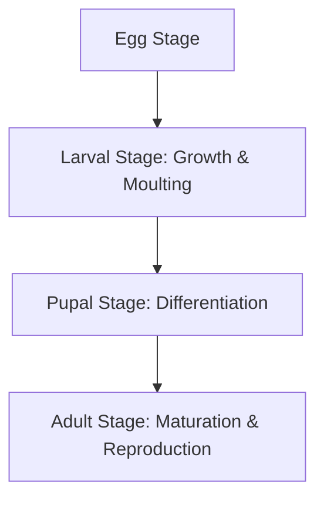
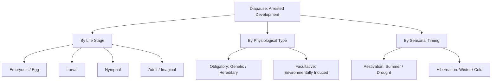
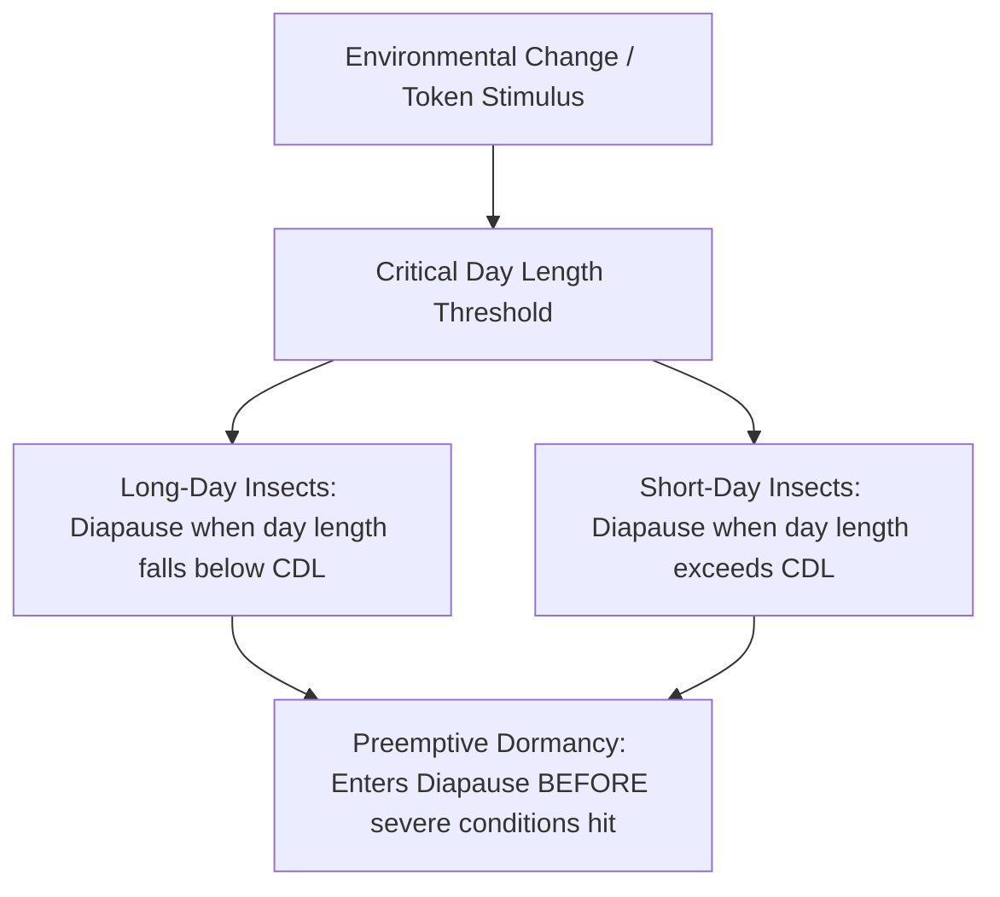

# Introduction


The biological development of an insect does not terminate upon hatching from the egg. Rather, the organism undergoes a continuous, highly regulated series of post-embryonic changes that guide it from a newly emerged, sexually immature state to a fully formed, reproductively capable adult. This entire sequence of post-embryonic changes—comprising physical growth, periodic shedding of the exoskeleton, tissue differentiation, and sexual maturation—is known as **morphogenesis**.



To contextualize morphogenesis, entomologists analyze the life cycles of representative insects, such as the complete transformation seen in the ladybug


 or the monarch butterfly


. These insects pass through structurally discrete stages—egg, larva, pupa, and adult—where each stage is specialized for a distinct ecological role, demonstrating complete physiological and morphological reorganization.

---

#

# 1. Morphogenesis: The Framework of Post-Embryonic Development

Morphogenesis is the overarching biological framework spanning an insect's entire post-embryonic life. It can be divided into three distinct, sequential phases, each occurring in a specific stage of the life cycle:
1. **Growth and Moulting**: Occurs during the immature larval stages, where the insect feeds voraciously and periodically sheds its rigid cuticle (moulting) to allow its body to expand.
2. **Differentiation**: Occurs primarily during the pupal stage, where larval tissues are histolysed (broken down) and histogenised (rebuilt) into complex adult structures.
3. **Maturation and Reproduction**: Occurs in the adult stage, where the insect develops functional reproductive organs and focuses its energy on dispersal and producing offspring.

**Metamorphosis** is the term used to describe the visible, often dramatic transformation in body form that connects these phases. A classic illustration of this process is the metamorphosis of the Hawk Moth, where a slow, leaf-chewing caterpillar transforms into a highly mobile, nectar-sipping winged adult.

Not all insects undergo the same degree of transformation. The evolutionary divergence of insects has resulted in different developmental pathways, principally divided into complete (**holometabolous**) and incomplete (**hemimetabolous**) metamorphosis


.
* **Holometabolous development** is characterized by a four-stage life cycle (egg, larva, pupa, adult) featuring a pupal stage that acts as a transition between the wormlike larva and the winged adult.
* **Hemimetabolous development** is a three-stage life cycle (egg, nymph, adult) where the immature nymph resembles a miniature, wingless adult and matures progressively without a pupal stage.

---

#

# 2. The Three Categories of Metamorphosis

To systematically classify how insects develop, entomologists group them into three primary categories based on the complexity of their transformation, the structural resemblance between young and adult, and wing development:
1. **No Metamorphosis (Ametabolous Development)**: Shown by primitive, wingless insects such as the silverfish


.
2. **Incomplete Metamorphosis (Hemimetabolous Development)**: Exhibited by lower insect orders such as the grasshopper


.
3. **Complete Metamorphosis (Holometabolous Development)**: Exhibited by higher insect orders such as the butterfly


.

#

## Comparative Analysis of Metamorphosis Categories

To thoroughly understand these developmental pathways, we must examine the comparative matrices presented across Slides 6, 7, and 8 of the lecture slides.

#

### Part 1: Developmental Stages, Pathways, and Egg Characteristics
* **A-metamorphosis (No Metamorphosis)**: Insects undergo slight or no physical transformation. The life cycle consists of three developmental stages: **egg, larva, and adult**. The pathway is **direct development**, meaning the young hatch in a form structurally identical to the adult and grow directly into adults. Eggs are laid naked with no protective coverings.
* **Hemi-metamorphosis (Incomplete Metamorphosis)**: Insects undergo partial transformation. The life cycle consists of three stages: **egg, nymph, and adult**. The developmental pathway is **direct development** (young to adult). Eggs are typically protected by a specialized egg case (ootheca) that holds them together.
* **Holo-metamorphosis (Complete Metamorphosis)**: Insects undergo complete transformation. The life cycle consists of four stages: **egg, larva, pupa, and adult**. The developmental pathway is **indirect development**, meaning the young must pass through an intermediate pupal stage before reaching adulthood. Eggs are often protected by maternal hairs or scales.

#

### Part 2: Resemblance, Terminology, and Diet
* **A-metamorphosis**: The young (immature) insect looks exactly like the adult in all external characters, with the sole exception of lacking functional sexual organs. The immature stage can be called either a **larva** or a **nymph**. Because they share the same body plan and mouthparts, the immature and mature stages share identical food habits.
* **Hemi-metamorphosis**: The young stage is called a **nymph**. It resembles the adult in most characters (such as eyes and mouthparts) but completely lacks functional wings, possessing only small wing pads. Nymphs and adults share identical food habits.
* **Holo-metamorphosis**: The young stage is called a **larva**. It does not resemble the adult at all, typically possessing a soft, wormlike body. Larvae differ from adults both in their external morphology and in their feeding habits. Consequently, larval and adult food habits are totally different, allowing them to exploit different ecological niches without competing with each other.

#

### Part 3: Pupal Presence, Wing Development, Taxonomy, and Abundance
* **A-metamorphosis**: There is **no pupal stage** in the life cycle; the larva/nymph directly becomes an adult. Adults are completely wingless. This pathway is restricted to primitive, primitively wingless insects known as **Apterygote** insects. Ametabolous insects are highly rare, accounting for **fewer than 0.1%** of all known insect species.
* **Hemi-metamorphosis**: The **pupal stage is absent**. Wings develop gradually and externally on the outside of the body as the nymph grows. This pattern of external wing development is called **Exopterygote** development, and it is characteristic of the lower (more primitive) insect orders. Hemimetabolous insects represent approximately **12%** of all insect species.
* **Holo-metamorphosis**: A **pupal stage is present** and serves as the vehicle for complete tissue reorganization. Wings develop internally within specialized pockets of the larval integument and only become visible externally during the pupal stage. This internal wing development is called **Endopterygote** development, and it is characteristic of the higher (more advanced) insect orders. Holometabolous insects are the evolutionary champions of the animal world, representing approximately **88%** of all insect species.

---

#

# 2.1 No Metamorphosis (Ametabolous Development)

In ametabolous development, the insect undergoes direct development with minimal physical change. When the young ametabolous insect hatches, it is essentially a miniature adult that lacks mature reproductive organs. As it feeds and undergoes successive moults, it increases in size but retains the same body plan, mouthparts, and sensory organs.

This developmental strategy is found exclusively in the subclass **Apterygota** (primitively wingless insects), which includes orders like Thysanura (silverfish)


. Because the young and adults share identical habitats and food sources (such as starch and decaying organic matter), they do not undergo ecological shifts during their life cycle.

---

#

# 2.2 Incomplete Metamorphosis (Hemimetabolous Development)

Hemimetabolous development is characterized by gradual, direct post-embryonic growth. The immature insect is called a **nymph**


. Structurally, the nymph possesses compound eyes, antennae, and mouthparts similar to the adult, but lacks functional wings and mature genitalia.

As the nymph feeds and grows, it passes through several developmental increments called instars. During each moult, external wing pads (visible as small, backward-pointing structures on the thorax) grow progressively larger. This external mode of wing growth classifies these insects as **Exopterygotes**. At the final moult, the nymph transforms directly into a fully winged, sexually mature adult without entering a resting pupal stage.

This life cycle is typical of lower insect orders, such as Orthoptera (grasshoppers and crickets), Hemiptera (true bugs), and Odonata (dragonflies). Because nymphs and adults share the same mouthparts and habitats, they often compete for the same food resources.

---

#

# 2.3 Complete Metamorphosis (Holometabolous Development)

Holometabolous development is the most ecologically successful insect life cycle, characterized by indirect development through four distinct stages: egg, larva, pupa, and adult


.

The immature stage, the **larva**, is specialized for feeding and accumulating energy reserves. Larvae are typically wormlike, possess simple lateral eyes (stemmata) instead of compound eyes, and have mouthparts and body forms completely different from the adult.

Once the larva completes its final instar, it transitions into the **pupa**, a non-feeding, often immobile stage. Within the pupa, the insect undergoes massive internal reorganization. The larval tissues are broken down, and adult structures—such as compound eyes, long antennae, jointed legs, and wings—are constructed from specialized embryonic cell clusters called imaginal discs. Because the wings develop internally during the larval stages and only expand during pupation, these insects are classified as **Endopterygotes**.

This complete separation of life stages provides a major evolutionary advantage: larvae and adults of the same species do not compete with each other. For example, a caterpillar (larva) feeds on solid plant leaves, whereas the adult butterfly sips liquid nectar, allowing the species to maximize resource utilization.

---

#

# 3. Hyper-Metamorphosis

**Hyper-metamorphosis** is a highly specialized variant of complete (holometabolous) metamorphosis. It is defined as a life cycle in which at least one of the larval instars is morphologically and functionally distinct from the other larval instars, representing two or more different forms of larva or a dramatic switch in feeding habits during the larval period.

Unlike standard holometabolous insects, which maintain a uniform larval body plan (such as a caterpillar that simply grows larger with each moult)


, hyper-metamorphic insects completely redesign their larval bodies to suit changing ecological needs.

```
[Egg] -> [Triungulin Larva] -> [Grub-like Larva] -> [Coarctate Larva] -> [Pupa] -> [Adult]
           (Active, Mobile)     (Sedentary, Feeder)   (Hardened, Dormant)
```

The classic example of hyper-metamorphosis occurs in the family Meloidae (blister beetles)


:
1. **Triungulin Larva**: The first larval instar is an active, long-legged, highly mobile seeker called a **triungulin**. Its primary function is to locate a host (such as finding solitary bee nests or grasshopper egg pods).
2. **Grub-like Larva**: Once the triungulin locates its food source, it moults into a soft-bodied, short-legged, sedentary grub-like form specialized solely for feeding on the host's eggs or provisions.
3. **Coarctate Stage**: The insect subsequently moults into a hardened, non-feeding, highly resistant resting larval stage (the coarctate larva) designed to survive harsh environmental conditions.
4. **Final Larval & Pupal Stages**: The insect moults once more into a final active larval form before pupating and emerging as a hairy adult beetle with orange-and-black banded wing covers


.

---

#

# 4. Diapause: Definition and Occurrence

Insects must survive seasonal adversity, such as freezing winters or scorching, dry summers. To do so, they have evolved physiological pause mechanisms.

**Diapause** is defined as a state of arrested development in which the arrest is enforced by an internal physiological mechanism rather than by concurrently unfavorable environmental conditions.

It is critical to distinguish diapause from **quiescence**:
* **Quiescence** is a direct, immediate, and non-programmed response to unfavorable environmental conditions (such as low temperature or lack of moisture). The moment favorable conditions return, the insect immediately resumes development.
* **Diapause** is a genetically programmed, anticipatory state. It is triggered by "token stimuli" (like changing day length) *before* the onset of severe conditions. Once an insect enters diapause, it cannot resume development immediately, even if environmental conditions temporarily improve, until a specific physiological "clock" has run its course


.



As illustrated in the classification pathways, diapause can occur at any stage of the insect's life cycle (embryonic, larval, pupal, or adult), depending on the species. It is further categorized by its physiological nature (obligatory vs. facultative) and by the season in which it occurs (aestivation vs. hibernation).

---

#

# 4.1 Diapause across Developmental Stages: Illustrative Species

Because different species have adapted to survive seasonal stress at different points in their development, the life stage in which diapause occurs is highly species-specific. The table below outlines the primary stages of diapause and the representative species that exhibit them:

| Diapause Stage | Common Name of Insect | Scientific Name of Insect |
| :--- | :--- | :--- |
| **Early-Embryonic Stage** (egg diapause) | Silk worm | *Bombyx mori* |
| **Mid-embryonic stage** (egg diapause) | Locust | *Schistocerca gregaria* |
| **Post-Embryonic Stage** (egg diapause) | Gypsy Moth | *Lymantria dispar* |
| **Larval diapause** | Bamboo borer | *Omphisa fuscidentalis* |
| **Larval diapause** | Rice stem borer | *Scirpophaga incertulas* |
| **Larval diapause** | Mosquito | *Aedes* spp. |
| **Pupal diapause** | Cabbage White | *Pieris brassicae* |
| **Adult diapause** (imaginal/reproductive) | Colorado potato beetle | *Leptinotarsa decemlineata* |

This table shows that egg diapause can be highly precise, occurring at early-embryonic (*Bombyx mori*), mid-embryonic (*Schistocerca gregaria*), or post-embryonic (*Lymantria dispar*) phases of development, depending on the evolutionary adaptations of the species.

---

#

# 5. Obligatory versus Facultative Diapause

From a physiological standpoint, diapause is categorized into two distinct types based on whether it is an unavoidable part of the life cycle or a flexible response to environmental cues:

#

## 1. Obligatory Diapause
Obligatory diapause is a genetically fixed, hereditary character controlled by genes. It is species-specific and occurs in every single generation, regardless of the immediate environmental conditions. Even if kept in a perfect, warm laboratory environment with abundant food, the insect will still enter diapause. This is common in temperate-zone insects that produce only one generation per year (univoltine species).
* *Example*: The eggs of the domestic silkworm, *Bombyx mori*, must undergo obligatory diapause to coordinate their life cycle with seasonal changes.

#

## 2. Facultative Diapause
Facultative diapause is a flexible developmental arrest that occurs only when induced by specific environmental conditions. If the environment remains favorable, the insect will continue to develop and reproduce generation after generation without pausing. However, if it receives cues that environmental quality is declining, it initiates the diapause program.
* *Triggers*: Facultative diapause can be brought on by **biotic factors** (such as high population density or increased predator pressure) or **abiotic factors** (such as changes in temperature, rainfall, humidity, photoperiod, or a decline in food quality).
* *Example*: The cotton pink bollworm (*Pectinophora gossypiella*) exhibits facultative larval diapause, allowing it to continue breeding during warm, irrigated crop seasons, but enter dormancy when dry, cold, or food-scarce conditions arise.

---

#

# 6. Photoperiod and the Timing of Diapause

How do insects accurately predict the onset of winter or summer drought weeks in advance? They rely primarily on **photoperiod**—the relative lengths of day and night in a 24-hour cycle. Unlike temperature or rainfall, which can fluctuate wildly from day to day, photoperiod is a completely stable, astronomically precise indicator of the calendar season.



As shown in the photoperiodic response pathway, insects process photoperiod through specific physiological thresholds:
* **Critical Day Length**: This is defined as the specific day length when exactly 50% of the insect population has entered diapause. The transition around this threshold is usually highly sudden, acting as a biological switch.
* **Long-day Insects**: These insects develop normally during the long days of summer and enter diapause when the day length falls below the critical day length threshold (signaling the approach of autumn/winter).
* **Short-day Insects**: These insects develop normally when there are only a few hours of sunlight (during winter/early spring) and enter diapause when exposed to longer day lengths (signaling the approach of hot, dry summer months).

Because photoperiod acts as a **token stimulus** (a predictive environmental cue), diapause begins *before* the actual severe weather conditions arrive, ensuring the insect is already dormant and protected when lethal temperatures or droughts hit.

---

#

# 6.1 Aestivation and Hibernation

Finally, diapause is categorized by the season in which the developmental arrest occurs, representing adaptations to different types of climatic stress:
* **Aestivation (Summer Diapause)**: Arrested development during the hot, dry summer months. Aestivating insects are active during the rainy season when food is abundant, and go dormant ("sleep") during droughts or extreme summer heat to conserve water and energy.
* **Hibernation (Winter Diapause)**: Arrested development during the cold winter months. Hibernating insects suspend metabolic activity to survive freezing temperatures and lack of host plants.

These seasonal states represent the same underlying physiological capacity to suspend development preemptively. During active larval states, insects may also utilize morphological defense mechanisms, such as the bright, warning coloration (**aposematism**) and highly branched, venomous urticating spines of the *Automeris io* (Io moth) caterpillar


, which protect the insect from predators while it feeds heavily to prepare for its impending metamorphosis or diapause.
