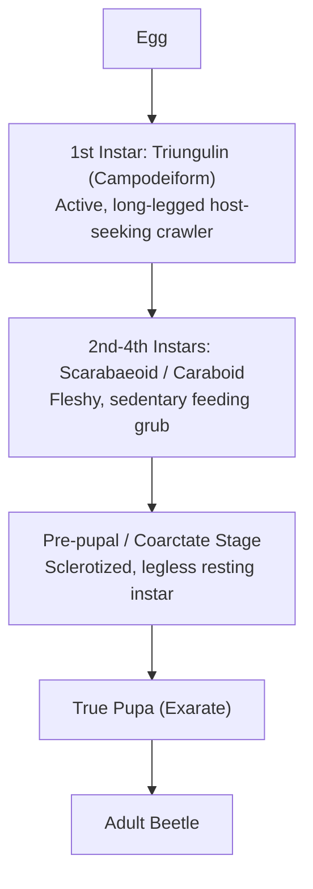
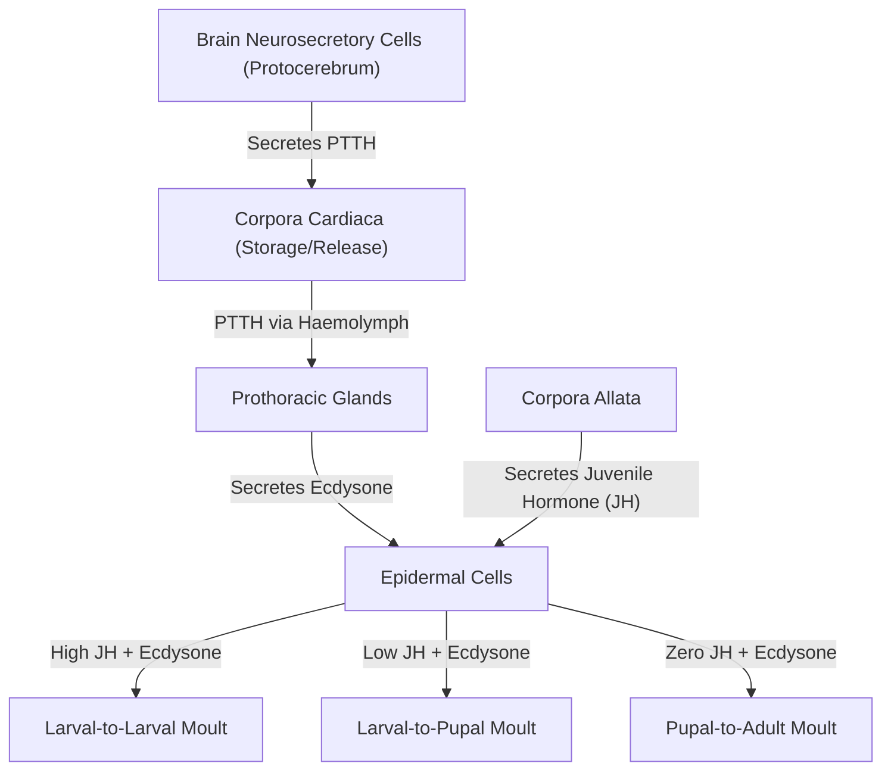

# Comprehensive Chapter Overview
This summary synthesizes the post-embryonic developmental framework of insects, comparing structural metamorphosis categories, larval and pupal morphological taxonomy, hypermetabolous lifecycles, neuroendocrine regulatory pathways, and photoperiodic diapause mechanisms.

---

#

# 1. Morphogenesis Framework & Post-Embryonic Phases
Morphogenesis represents the totality of post-embryonic structural changes occurring between egg hatching and adult sexual maturity.

* **Growth Phase**: Accompanied by periodic ecdysis (moulting) to accommodate cuticle expansion.
* **Differentiation Phase**: Occurs during the pupal stage of holometabolous insects; involves **histolysis** (enzymatic breakdown of larval tissues) and **histogenesis** (formation of adult organs from imaginal discs).
* **Maturation Phase**: Sclerotization of the cuticle via Bursicon and activation of gonads for reproduction.

---

#

# 2. Structural Categories of Metamorphosis

| Feature / Criteria | Ametabolous (No Metamorphosis) | Hemimetabolous (Incomplete) | Holometabolous (Complete) |
| :--- | :--- | :--- | :--- |
| **Developmental Arc** | Direct (`Egg -> Larva/Nymph -> Adult`) | Direct (`Egg -> Nymph -> Adult`) | Indirect (`Egg -> Larva -> Pupa -> Adult`) |
| **Number of Stages** | 3 Stages | 3 Stages | 4 Stages |
| **Immature Terminology** | Larva or Nymph | Nymph (or Aquatic Naiad) | Larva |
| **Pupal Stage** | Absent | Absent | Present (Transitory Phase) |
| **Wing Morphogenesis** | Wingless adults (Apterygota) | External wing pads (Exopterygota) | Internal imaginal discs (Endopterygota) |
| **Ecological Niche** | Immature & adult diets identical | Immature & adult diets identical | Larval & adult diets decoupled |
| **Species Proportion** | $< 0.1\%$ | $\sim 12\%$ | $\sim 88\%$ |

---

#

# 3. Immature & Pupal Taxonomy

#

## A. Larval Classifications
1. **Eruciform**: Cylindrical body with 3 pairs of thoracic legs and 2–5 pairs of abdominal prolegs with crochets (Lepidoptera, Symphyta).
2. **Scarabaeiform**: Fleshy C-shaped grub with sclerotized head, well-developed thoracic legs, no prolegs (Scarabaeidae).
3. **Campodeiform**: Elongate, dorso-ventrally flattened active predator with prominent legs and cerci (Neuroptera, Carabidae).
4. **Elateriform**: Cylindrical, heavily sclerotized wireworm-like body with short thoracic legs (Elateridae).
5. **Vermiform**: Legless maggot with reduced head capsule and mouthhooks (Diptera).

#

## B. Pupal Classifications
1. **Exarate**: Appendages free and unattached to body wall (Coleoptera, Hymenoptera).
2. **Obtect**: Appendages glued tightly to body wall by cuticular secretion (Lepidoptera chrysalis).
3. **Coarctate**: Enclosed inside a hardened, brown 4th/5th larval puparium (Diptera).
4. **Decticous vs Adecticous**: Functional articulated pupal mandibles for cocoon escape (Decticous: Neuroptera) vs non-functional mandibles (Adecticous: Lepidoptera, Diptera).

---

#

# 4. Hyper-Metamorphosis
A specialized variant of complete metamorphosis involving two or more morphologically and functionally distinct larval instars:

* **Primary Taxa**: Meloidae (blister beetles), Stylopidae (twisted-wing parasites).

---

#

# 5. Neuroendocrine Regulatory Axis

* **Bursicon**: Neurohormone released post-eclosion to trigger epidermal sclerotization (cuticular tanning) and wing expansion.

---

#

# 6. Diapause Chronobiology & Voltinism

#

## A. Quiescence vs. Diapause
* **Quiescence**: Non-programmed, immediate physical arrest directly caused by unfavorable environmental conditions; halts as soon as conditions improve.
* **Diapause**: Neurohormonally enforced state of metabolic suppression triggered in advance by token stimuli (photoperiod).

#

## B. Diapause Types & Voltinism
* **Obligatory Diapause**: Genetically fixed in every generation; characteristic of **univoltine** species (1 generation/year).
* **Facultative Diapause**: Induced by environmental token stimuli (short day length); characteristic of **multivoltine** species.
* **Seasonal Types**: **Aestivation** (summer drought dormancy) vs. **Hibernation** (winter cold dormancy).

#

## C. Species-Specific Diapause Matrix (Table tbl_005)
* **Embryonic (Egg)**: *Bombyx mori* (Silkworm)
* **Larval**: *Omphisa fuscidentalis* (Bamboo borer)
* **Pupal**: *Pieris brassicae* (Cabbage white butterfly)
* **Imaginal (Adult)**: *Leptinotarsa decemlineata* (Colorado potato beetle)
