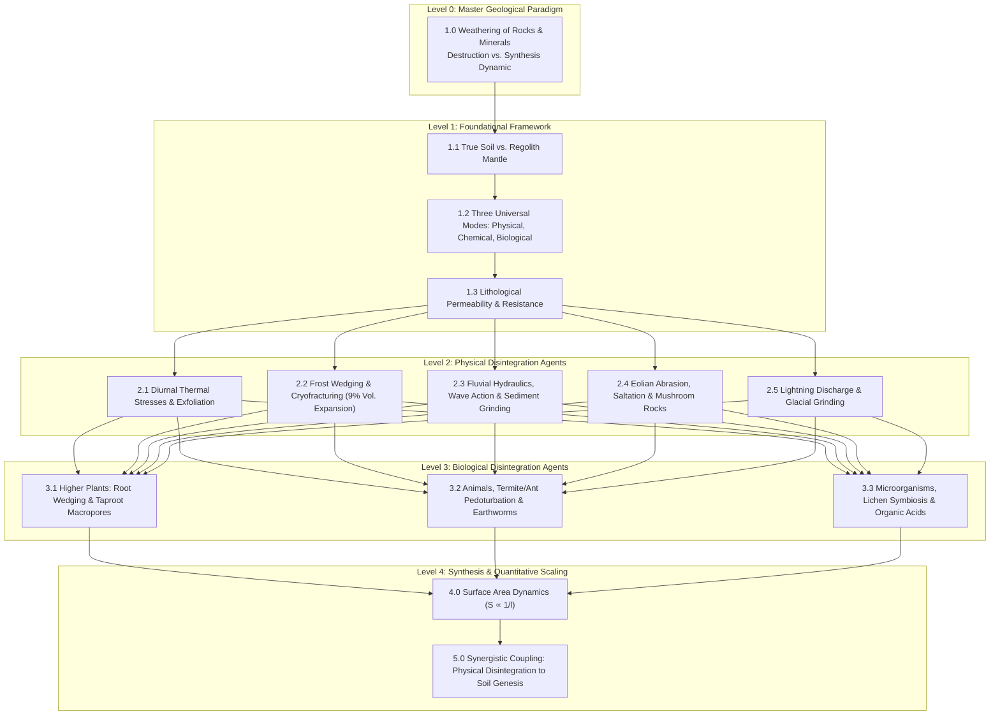

# Study Plan: Weathering of Rocks and Minerals — Types, Physical & Biological Agents

> **Pedagogical Master Blueprint**: A multimodal, pacing-aware study roadmap designed for agricultural undergraduates (ANGRAU / ICAR Fundamentals of Soil Science). Maps the entire Lecture 5 curriculum into four structured learning tracks with exact temporal arithmetic, cognitive Bloom's taxonomy milestones, and direct active local file links.

---

## 🎯 Bloom's Taxonomy Cognitive Milestones

* **L1: Remember & Understand (Foundational Knowledge)**: Define weathering; distinguish between disintegration (physical) and decomposition (chemical); contrast parent rock, regolith mantle, and true living soil; enumerate primary physical and biological weathering agents.
* **L2: Apply & Calculate (Quantitative Modeling)**: Compute specific surface area scaling ($S \propto 1/l$) as a $1\,\text{m}^3$ monolith cleaves down to clay-sized particles; calculate volumetric ice expansion ($9\%$) and resultant hydrostatic cryofracturing bursting pressures ($1465\,\text{Mg/m}^2$); compute mineral differential expansion quotients between quartz and orthoclase feldspar.
* **L3: Analyze & Differentiate (Mechanistic Dissection)**: Compare diurnal temperature oscillation and onion-skin exfoliation vs. differential mineral expansion; analyze the differential action of stream sediment attrition vs. eolian sandblast undercut (mushroom rocks); differentiate mechanical root wedging from rhizosphere organic acid chelation.
* **L4: Evaluate & Synthesize (Biogeochemical Systems)**: Synthesize the synergistic positive feedback loop wherein physical fracturing drives an exponential increase in reactive surface area, accelerating chemical mineral hydrolysis and enabling biological pedogenesis.

---

## 🗺️ Topic Dependency & Curricular Progression Flowchart

---

## 📖 Blueprint 1: Standard 5-Day Mastery Track (Undergraduate Semester)

Paced at ~70–75 minutes per day with exact temporal arithmetic summing to **360 minutes total (6.0 hours)**:

| Day | Modules Covered | Sequential Reading & Practice Path | Daily Time |
| :---: | :--- | :--- | :---: |
| **Day 1** | **Foundations of Weathering, Regolith Genesis & The Three Universal Modes** | [Mindmap](file:///C:/Users/hulkh/Downloads/Gen%20Assest%20-%20Copy/Assets/ANGRAU/Lec-5%20Weathering/Foundation/Mind%20Maps/Lec_5_Weathering_Mindmap.md) (10m) $\to$ [Quick Listen](file:///C:/Users/hulkh/Downloads/Gen%20Assest%20-%20Copy/Assets/ANGRAU/Lec-5%20Weathering/Listening/Quick%20Listen/Lec_5_Weathering_audio_script_35min.md) (15m) $\to$ [Quick Summary](file:///C:/Users/hulkh/Downloads/Gen%20Assest%20-%20Copy/Assets/ANGRAU/Lec-5%20Weathering/Reading/Quick%20Study/quick_summary_beginner.md) (15m) $\to$ [Detailed Study](file:///C:/Users/hulkh/Downloads/Gen%20Assest%20-%20Copy/Assets/ANGRAU/Lec-5%20Weathering/Reading/Detailed%20Study/detailed_summary_beginner.md) (15m) $\to$ [Beginner Flashcards](file:///C:/Users/hulkh/Downloads/Gen%20Assest%20-%20Copy/Assets/ANGRAU/Lec-5%20Weathering/Practice/Revise%20%28Flashcards%29/flashcards_beginner.md) (8m) $\to$ [Easy MCQ](file:///C:/Users/hulkh/Downloads/Gen%20Assest%20-%20Copy/Assets/ANGRAU/Lec-5%20Weathering/Practice/Assessments/MCQ/mcq_easy.md) (7m) | **70m** |
| **Day 2** | **Physical Disintegration I — Thermal Stresses, Mineral Albedo & Exfoliation Mechanics** | [Infographics Playbook](file:///C:/Users/hulkh/Downloads/Gen%20Assest%20-%20Copy/Assets/ANGRAU/Lec-5%20Weathering/Foundation/Infographics/Dummy/motion_infographics_playbook.md) (10m) $\to$ [Video Watch Prompts](file:///C:/Users/hulkh/Downloads/Gen%20Assest%20-%20Copy/Assets/ANGRAU/Lec-5%20Weathering/Watching/v6/ANGRAU_Lec_5_Weathering_Main_Video_Prompts_v6.md) (15m) $\to$ [Detailed Study](file:///C:/Users/hulkh/Downloads/Gen%20Assest%20-%20Copy/Assets/ANGRAU/Lec-5%20Weathering/Reading/Detailed%20Study/detailed_summary_beginner.md) (25m) $\to$ [Beginner Flashcards](file:///C:/Users/hulkh/Downloads/Gen%20Assest%20-%20Copy/Assets/ANGRAU/Lec-5%20Weathering/Practice/Revise%20%28Flashcards%29/flashcards_beginner.md) (10m) $\to$ [Easy MSQ](file:///C:/Users/hulkh/Downloads/Gen%20Assest%20-%20Copy/Assets/ANGRAU/Lec-5%20Weathering/Practice/Assessments/MSQ/msq_easy.md) (15m) | **75m** |
| **Day 3** | **Physical Disintegration II — Frost Wedging, Fluvial Action, Wind & Lightning** | [Quick Listen](file:///C:/Users/hulkh/Downloads/Gen%20Assest%20-%20Copy/Assets/ANGRAU/Lec-5%20Weathering/Listening/Quick%20Listen/Lec_5_Weathering_audio_script_35min.md) (15m) $\to$ [Detailed Study](file:///C:/Users/hulkh/Downloads/Gen%20Assest%20-%20Copy/Assets/ANGRAU/Lec-5%20Weathering/Reading/Detailed%20Study/detailed_summary_beginner.md) (25m) $\to$ [Beginner Flashcards](file:///C:/Users/hulkh/Downloads/Gen%20Assest%20-%20Copy/Assets/ANGRAU/Lec-5%20Weathering/Practice/Revise%20%28Flashcards%29/flashcards_beginner.md) (12m) $\to$ [Medium MCQ](file:///C:/Users/hulkh/Downloads/Gen%20Assest%20-%20Copy/Assets/ANGRAU/Lec-5%20Weathering/Practice/Assessments/MCQ/mcq_medium.md) (11m) $\to$ [Medium MSQ](file:///C:/Users/hulkh/Downloads/Gen%20Assest%20-%20Copy/Assets/ANGRAU/Lec-5%20Weathering/Practice/Assessments/MSQ/msq_medium.md) (12m) | **75m** |
| **Day 4** | **Biological Disintegration — Root Wedging, Fauna, Microbes & Organic Acids** | [Detailed Study](file:///C:/Users/hulkh/Downloads/Gen%20Assest%20-%20Copy/Assets/ANGRAU/Lec-5%20Weathering/Reading/Detailed%20Study/detailed_summary_beginner.md) (25m) $\to$ [Glossary](file:///C:/Users/hulkh/Downloads/Gen%20Assest%20-%20Copy/Assets/ANGRAU/Lec-5%20Weathering/Reading/Glossary/glossary.md) (15m) $\to$ [Beginner Flashcards](file:///C:/Users/hulkh/Downloads/Gen%20Assest%20-%20Copy/Assets/ANGRAU/Lec-5%20Weathering/Practice/Revise%20%28Flashcards%29/flashcards_beginner.md) (10m) $\to$ [Hard MCQ](file:///C:/Users/hulkh/Downloads/Gen%20Assest%20-%20Copy/Assets/ANGRAU/Lec-5%20Weathering/Practice/Assessments/MCQ/mcq_hard.md) (10m) $\to$ [Hard MSQ](file:///C:/Users/hulkh/Downloads/Gen%20Assest%20-%20Copy/Assets/ANGRAU/Lec-5%20Weathering/Practice/Assessments/MSQ/msq_hard.md) (10m) | **70m** |
| **Day 5** | **Surface Area Dynamics, Spaced Interleaved Revision & Summative Exams** | [Key Takeaways](file:///C:/Users/hulkh/Downloads/Gen%20Assest%20-%20Copy/Assets/ANGRAU/Lec-5%20Weathering/new/key_takeaways.md) (5m) $\to$ [Question Bank](file:///C:/Users/hulkh/Downloads/Gen%20Assest%20-%20Copy/Assets/ANGRAU/Lec-5%20Weathering/new/question_bank.md) (15m) $\to$ [Revision Flashcards](file:///C:/Users/hulkh/Downloads/Gen%20Assest%20-%20Copy/Assets/ANGRAU/Lec-5%20Weathering/Practice/Revise%20%28Flashcards%29/flashcards_revise.md) (15m) $\to$ [Mock Test](file:///C:/Users/hulkh/Downloads/Gen%20Assest%20-%20Copy/Assets/ANGRAU/Lec-5%20Weathering/Practice/Assessments/Mock_Test/mock_test_lec_5_weathering.md) (35m) | **70m** |

---

## 🏃 Blueprint 2: Fast-Track 3-Day Sprint (Intermediate / Mid-term Review)

Calibrated at ~75–80 minutes per day for rapid mid-term review summing to **230 minutes total (3.83 hours)**:

| Day | Modules Covered | Reading & Practice Path | Daily Time |
| :---: | :--- | :--- | :---: |
| **Day 1** | **Foundations, Thermal Disintegration & Exfoliation Mechanics** | [Mindmap](file:///C:/Users/hulkh/Downloads/Gen%20Assest%20-%20Copy/Assets/ANGRAU/Lec-5%20Weathering/Foundation/Mind%20Maps/Lec_5_Weathering_Mindmap.md) (10m) $\to$ [Quick Summary](file:///C:/Users/hulkh/Downloads/Gen%20Assest%20-%20Copy/Assets/ANGRAU/Lec-5%20Weathering/Reading/Quick%20Study/quick_summary_intermediate.md) (15m) $\to$ [Detailed Study](file:///C:/Users/hulkh/Downloads/Gen%20Assest%20-%20Copy/Assets/ANGRAU/Lec-5%20Weathering/Reading/Detailed%20Study/detailed_summary_intermediate.md) (30m) $\to$ [Intermediate Flashcards](file:///C:/Users/hulkh/Downloads/Gen%20Assest%20-%20Copy/Assets/ANGRAU/Lec-5%20Weathering/Practice/Revise%20%28Flashcards%29/flashcards_intermediate.md) (10m) $\to$ [Medium MCQ](file:///C:/Users/hulkh/Downloads/Gen%20Assest%20-%20Copy/Assets/ANGRAU/Lec-5%20Weathering/Practice/Assessments/MCQ/mcq_medium.md) (10m) | **75m** |
| **Day 2** | **Cryofracturing, Fluvial, Eolian & Biological Agents** | [Quick Listen](file:///C:/Users/hulkh/Downloads/Gen%20Assest%20-%20Copy/Assets/ANGRAU/Lec-5%20Weathering/Listening/Quick%20Listen/Lec_5_Weathering_audio_script_35min.md) (15m) $\to$ [Detailed Study](file:///C:/Users/hulkh/Downloads/Gen%20Assest%20-%20Copy/Assets/ANGRAU/Lec-5%20Weathering/Reading/Detailed%20Study/detailed_summary_intermediate.md) (30m) $\to$ [Intermediate Flashcards](file:///C:/Users/hulkh/Downloads/Gen%20Assest%20-%20Copy/Assets/ANGRAU/Lec-5%20Weathering/Practice/Revise%20%28Flashcards%29/flashcards_intermediate.md) (10m) $\to$ [Medium MSQ](file:///C:/Users/hulkh/Downloads/Gen%20Assest%20-%20Copy/Assets/ANGRAU/Lec-5%20Weathering/Practice/Assessments/MSQ/msq_medium.md) (10m) $\to$ [Question Bank](file:///C:/Users/hulkh/Downloads/Gen%20Assest%20-%20Copy/Assets/ANGRAU/Lec-5%20Weathering/new/question_bank.md) (10m) | **75m** |
| **Day 3** | **Surface Area Scaling, Spaced Repetition & Mock Exam** | [Key Takeaways](file:///C:/Users/hulkh/Downloads/Gen%20Assest%20-%20Copy/Assets/ANGRAU/Lec-5%20Weathering/new/key_takeaways.md) (5m) $\to$ [Glossary](file:///C:/Users/hulkh/Downloads/Gen%20Assest%20-%20Copy/Assets/ANGRAU/Lec-5%20Weathering/Reading/Glossary/glossary.md) (10m) $\to$ [Question Bank](file:///C:/Users/hulkh/Downloads/Gen%20Assest%20-%20Copy/Assets/ANGRAU/Lec-5%20Weathering/new/question_bank.md) (15m) $\to$ [Revision Flashcards](file:///C:/Users/hulkh/Downloads/Gen%20Assest%20-%20Copy/Assets/ANGRAU/Lec-5%20Weathering/Practice/Revise%20%28Flashcards%29/flashcards_revise.md) (15m) $\to$ [Mock Test](file:///C:/Users/hulkh/Downloads/Gen%20Assest%20-%20Copy/Assets/ANGRAU/Lec-5%20Weathering/Practice/Assessments/Mock_Test/mock_test_lec_5_weathering.md) (35m) | **80m** |

---

## 🚀 Blueprint 3: Intensive 2-Day Fast-Track Sprint (Advanced / Pre-Exam & ICAR JRF)

Calibrated at ~110–115 minutes per day for competitive exam preparation summing to **225 minutes total (3.75 hours)**:

| Day | Modules Covered | Reading & Practice Path | Daily Time |
| :---: | :--- | :--- | :---: |
| **Day 1** | **Comprehensive Mechanistic Ingestion: Physical & Biological Breakdown** | [Mindmap](file:///C:/Users/hulkh/Downloads/Gen%20Assest%20-%20Copy/Assets/ANGRAU/Lec-5%20Weathering/Foundation/Mind%20Maps/Lec_5_Weathering_Mindmap.md) (10m) $\to$ [Detailed Audio Lecture](file:///C:/Users/hulkh/Downloads/Gen%20Assest%20-%20Copy/Assets/ANGRAU/Lec-5%20Weathering/Listening/Detailed%20Listen/Lec_5_Weathering_continuous_audio_script_50min.md) (30m) $\to$ [Detailed Study Advanced](file:///C:/Users/hulkh/Downloads/Gen%20Assest%20-%20Copy/Assets/ANGRAU/Lec-5%20Weathering/Reading/Detailed%20Study/detailed_summary_advanced.md) (40m) $\to$ [Advanced Flashcards](file:///C:/Users/hulkh/Downloads/Gen%20Assest%20-%20Copy/Assets/ANGRAU/Lec-5%20Weathering/Practice/Revise%20%28Flashcards%29/flashcards_advanced.md) (15m) $\to$ [Hard MCQ](file:///C:/Users/hulkh/Downloads/Gen%20Assest%20-%20Copy/Assets/ANGRAU/Lec-5%20Weathering/Practice/Assessments/MCQ/mcq_hard.md) (15m) | **110m** |
| **Day 2** | **Quantitative Surface Area Math, Question Bank Mastery & High-Stakes Exams** | [Key Takeaways](file:///C:/Users/hulkh/Downloads/Gen%20Assest%20-%20Copy/Assets/ANGRAU/Lec-5%20Weathering/new/key_takeaways.md) (5m) $\to$ [Question Bank](file:///C:/Users/hulkh/Downloads/Gen%20Assest%20-%20Copy/Assets/ANGRAU/Lec-5%20Weathering/new/question_bank.md) (20m) $\to$ [Hard MSQ](file:///C:/Users/hulkh/Downloads/Gen%20Assest%20-%20Copy/Assets/ANGRAU/Lec-5%20Weathering/Practice/Assessments/MSQ/msq_hard.md) (15m) $\to$ [Mock Test](file:///C:/Users/hulkh/Downloads/Gen%20Assest%20-%20Copy/Assets/ANGRAU/Lec-5%20Weathering/Practice/Assessments/Mock_Test/mock_test_lec_5_weathering.md) (35m) $\to$ [Certification Exam](file:///C:/Users/hulkh/Downloads/Gen%20Assest%20-%20Copy/Assets/ANGRAU/Lec-5%20Weathering/Preparation/Prep.%20Exam/certification_exam.md) (40m) | **115m** |

---

## 📅 Blueprint 4: Distributed 14-Day Semester Track (Daily Micro-Habit)

Calibrated at ~20–25 minutes per day for modular semester pacing summing to **322 minutes total (5.37 hours)**:

| Day | Focus Topic | Activity Sequence & Curated Link | Daily Time |
| :---: | :--- | :--- | :---: |
| **Day 1** | Weathering Definition & Master Geological Paradigm | [Mindmap](file:///C:/Users/hulkh/Downloads/Gen%20Assest%20-%20Copy/Assets/ANGRAU/Lec-5%20Weathering/Foundation/Mind%20Maps/Lec_5_Weathering_Mindmap.md) (10m) $\to$ [Quick Summary](file:///C:/Users/hulkh/Downloads/Gen%20Assest%20-%20Copy/Assets/ANGRAU/Lec-5%20Weathering/Reading/Quick%20Study/quick_summary_beginner.md) (10m) | **20m** |
| **Day 2** | True Soil vs. Regolith Mantle Genesis | [Detailed Study](file:///C:/Users/hulkh/Downloads/Gen%20Assest%20-%20Copy/Assets/ANGRAU/Lec-5%20Weathering/Reading/Detailed%20Study/detailed_summary_beginner.md) (15m) $\to$ [Key Takeaways](file:///C:/Users/hulkh/Downloads/Gen%20Assest%20-%20Copy/Assets/ANGRAU/Lec-5%20Weathering/new/key_takeaways.md) (5m) | **20m** |
| **Day 3** | The Three Universal Modes & Dynamic Feedback Loop | [Detailed Study](file:///C:/Users/hulkh/Downloads/Gen%20Assest%20-%20Copy/Assets/ANGRAU/Lec-5%20Weathering/Reading/Detailed%20Study/detailed_summary_beginner.md) (15m) $\to$ [Beginner Flashcards](file:///C:/Users/hulkh/Downloads/Gen%20Assest%20-%20Copy/Assets/ANGRAU/Lec-5%20Weathering/Practice/Revise%20%28Flashcards%29/flashcards_beginner.md) (7m) | **22m** |
| **Day 4** | Lithological Permeability, Texture & Decay Rate | [Detailed Study](file:///C:/Users/hulkh/Downloads/Gen%20Assest%20-%20Copy/Assets/ANGRAU/Lec-5%20Weathering/Reading/Detailed%20Study/detailed_summary_beginner.md) (14m) $\to$ [Easy MCQ](file:///C:/Users/hulkh/Downloads/Gen%20Assest%20-%20Copy/Assets/ANGRAU/Lec-5%20Weathering/Practice/Assessments/MCQ/mcq_easy.md) (8m) | **22m** |
| **Day 5** | Diurnal Thermal Stresses & Mineral Differential Expansion | [Detailed Study](file:///C:/Users/hulkh/Downloads/Gen%20Assest%20-%20Copy/Assets/ANGRAU/Lec-5%20Weathering/Reading/Detailed%20Study/detailed_summary_beginner.md) (15m) $\to$ [Beginner Flashcards](file:///C:/Users/hulkh/Downloads/Gen%20Assest%20-%20Copy/Assets/ANGRAU/Lec-5%20Weathering/Practice/Revise%20%28Flashcards%29/flashcards_beginner.md) (5m) | **20m** |
| **Day 6** | Exfoliation Onion-Skin Peeling & Flaking Mechanics | [Detailed Study](file:///C:/Users/hulkh/Downloads/Gen%20Assest%20-%20Copy/Assets/ANGRAU/Lec-5%20Weathering/Reading/Detailed%20Study/detailed_summary_beginner.md) (14m) $\to$ [Easy MSQ](file:///C:/Users/hulkh/Downloads/Gen%20Assest%20-%20Copy/Assets/ANGRAU/Lec-5%20Weathering/Practice/Assessments/MSQ/msq_easy.md) (8m) | **22m** |
| **Day 7** | Frost Wedging / Cryofracturing & Ice 9% Volume Expansion | [Detailed Study](file:///C:/Users/hulkh/Downloads/Gen%20Assest%20-%20Copy/Assets/ANGRAU/Lec-5%20Weathering/Reading/Detailed%20Study/detailed_summary_beginner.md) (15m) $\to$ [Intermediate Flashcards](file:///C:/Users/hulkh/Downloads/Gen%20Assest%20-%20Copy/Assets/ANGRAU/Lec-5%20Weathering/Practice/Revise%20%28Flashcards%29/flashcards_intermediate.md) (7m) | **22m** |
| **Day 8** | Fluvial Current Velocity, Wave Action & Sediment Grinding | [Detailed Study](file:///C:/Users/hulkh/Downloads/Gen%20Assest%20-%20Copy/Assets/ANGRAU/Lec-5%20Weathering/Reading/Detailed%20Study/detailed_summary_beginner.md) (15m) $\to$ [Key Takeaways](file:///C:/Users/hulkh/Downloads/Gen%20Assest%20-%20Copy/Assets/ANGRAU/Lec-5%20Weathering/new/key_takeaways.md) (5m) | **20m** |
| **Day 9** | Eolian Wind Saltation, Abrasion & Mushroom Rock Genesis | [Detailed Study](file:///C:/Users/hulkh/Downloads/Gen%20Assest%20-%20Copy/Assets/ANGRAU/Lec-5%20Weathering/Reading/Detailed%20Study/detailed_summary_beginner.md) (15m) $\to$ [Medium MCQ](file:///C:/Users/hulkh/Downloads/Gen%20Assest%20-%20Copy/Assets/ANGRAU/Lec-5%20Weathering/Practice/Assessments/MCQ/mcq_medium.md) (10m) | **25m** |
| **Day 10** | Higher Plant Root Wedging & Taproot Macropores | [Detailed Study](file:///C:/Users/hulkh/Downloads/Gen%20Assest%20-%20Copy/Assets/ANGRAU/Lec-5%20Weathering/Reading/Detailed%20Study/detailed_summary_beginner.md) (15m) $\to$ [Intermediate Flashcards](file:///C:/Users/hulkh/Downloads/Gen%20Assest%20-%20Copy/Assets/ANGRAU/Lec-5%20Weathering/Practice/Revise%20%28Flashcards%29/flashcards_intermediate.md) (7m) | **22m** |
| **Day 11** | Burrowing Fauna, Termites, Ants & Earthworms | [Detailed Study](file:///C:/Users/hulkh/Downloads/Gen%20Assest%20-%20Copy/Assets/ANGRAU/Lec-5%20Weathering/Reading/Detailed%20Study/detailed_summary_beginner.md) (14m) $\to$ [Medium MSQ](file:///C:/Users/hulkh/Downloads/Gen%20Assest%20-%20Copy/Assets/ANGRAU/Lec-5%20Weathering/Practice/Assessments/MSQ/msq_medium.md) (10m) | **24m** |
| **Day 12** | Lichens, Mosses & Microbial Organic Acid Chelation | [Detailed Study](file:///C:/Users/hulkh/Downloads/Gen%20Assest%20-%20Copy/Assets/ANGRAU/Lec-5%20Weathering/Reading/Detailed%20Study/detailed_summary_beginner.md) (15m) $\to$ [Hard MCQ](file:///C:/Users/hulkh/Downloads/Gen%20Assest%20-%20Copy/Assets/ANGRAU/Lec-5%20Weathering/Practice/Assessments/MCQ/mcq_hard.md) (10m) | **25m** |
| **Day 13** | Specific Surface Area Dynamics ($S \propto 1/l$) & Chemical Coupling | [Detailed Study](file:///C:/Users/hulkh/Downloads/Gen%20Assest%20-%20Copy/Assets/ANGRAU/Lec-5%20Weathering/Reading/Detailed%20Study/detailed_summary_beginner.md) (14m) $\to$ [Hard MSQ](file:///C:/Users/hulkh/Downloads/Gen%20Assest%20-%20Copy/Assets/ANGRAU/Lec-5%20Weathering/Practice/Assessments/MSQ/msq_hard.md) (14m) | **28m** |
| **Day 14** | Final Synthesis, Question Bank Review & Mock Examination | [Key Takeaways](file:///C:/Users/hulkh/Downloads/Gen%20Assest%20-%20Copy/Assets/ANGRAU/Lec-5%20Weathering/new/key_takeaways.md) (5m) $\to$ [Question Bank](file:///C:/Users/hulkh/Downloads/Gen%20Assest%20-%20Copy/Assets/ANGRAU/Lec-5%20Weathering/new/question_bank.md) (10m) $\to$ [Mock Test](file:///C:/Users/hulkh/Downloads/Gen%20Assest%20-%20Copy/Assets/ANGRAU/Lec-5%20Weathering/Practice/Assessments/Mock_Test/mock_test_lec_5_weathering.md) (15m) | **30m** |
